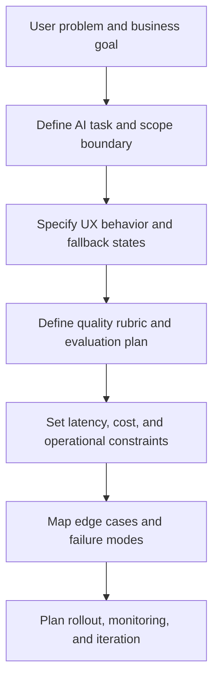

# AI PRD Writing

Traditional PRDs assume deterministic systems. AI PRDs cannot.

When you ship an AI feature, you are not only specifying screens, flows, and business rules. You are specifying acceptable behavior under uncertainty. That means the PRD has to answer questions a normal product spec often ignores:

- What counts as a good answer versus a merely plausible answer?
- How will the team evaluate output quality before launch and after launch?
- What should happen when the model is uncertain, incomplete, or wrong?
- Which edge cases matter most?
- What is the fallback path if the AI layer fails?
- Which latency budget is acceptable for the user experience you are designing?

If your PRD does not answer those questions, the team will answer them implicitly during implementation, testing, or escalation. That usually means the hardest product decisions get made too late and under pressure.

This section is about writing AI PRDs that are useful in the real world: specific enough to align product, design, engineering, data, and leadership; flexible enough to handle probabilistic behavior; and grounded enough to survive contact with production constraints.

## What Makes An AI PRD Different

A good traditional PRD usually covers:

- problem
- users
- goals
- requirements
- UX flow
- success metrics

A good AI PRD must also cover:

- task definition for the model
- model or model-class rationale
- evaluation plan and quality rubric
- hallucination and failure handling
- fallback behavior
- human-in-the-loop design
- latency budgets and operational constraints
- data requirements and limitations
- edge-case taxonomy
- “what could go wrong” scenarios

In other words, an AI PRD is not only a feature spec. It is a behavior spec plus an uncertainty management plan.

## The Recommended Approach

Write the PRD in layers.

### 1. Start with user value, not model capability

Do not start by saying “we can use an LLM here.” Start by naming the user problem and the job to be done. If the user value is weak or vague, the AI implementation will drift into demo logic.

### 2. Define the AI task narrowly

The biggest PRD failure in AI work is scope blur. Teams write “the assistant helps users find homes” when the actual product behavior includes intent capture, ambiguity detection, clarification, search translation, ranking support, explanation generation, and fallback messaging. That is too much ambiguity for a single sentence.

Break the task down. What exactly is the model supposed to do? What is it not allowed to do? What remains deterministic? What must stay under explicit product control?

### 3. Specify quality before discussing launch

If the PRD says “success is better engagement,” it is not ready. You need feature-specific quality criteria:

- response relevance
- factual correctness
- constraint compliance
- hallucination rate
- latency
- task completion

For some products, “80% accuracy” is great. For others, it is unacceptable. The PRD has to say which is which and why.

### 4. Treat fallback behavior as part of the product

In AI products, failure handling is not a technical detail. It is a first-class user experience and trust decision.

You need to specify:

- when the product should ask a clarifying question
- when it should show ranked manual results instead of a synthesized answer
- when it should disclose uncertainty
- when it should escalate to a human or revert to a non-AI flow

### 5. Include edge cases before engineering asks for them

If the PRD does not define the messy cases, the team will improvise them. That is where alignment breaks. Think about adversarial inputs, ambiguous instructions, language variation, missing data, and unsafe or unsupported requests up front.

## The Core AI PRD Flow

The order matters. If you jump to model choice or architecture before task definition and quality criteria, the PRD becomes backward: implementation first, product judgment later.

## What This Section Contains

- [`SKILL.md`](./SKILL.md): a guided workflow you can paste into an LLM to co-write an AI PRD step by step
- [`template.md`](./template.md): a reusable AI PRD template
- [`examples/conversational-search.md`](./examples/conversational-search.md): a fully filled PRD for a conversational marketplace search feature
- [`examples/computer-vision.md`](./examples/computer-vision.md): a fully filled PRD for image-based feature detection
- [`examples/voice-agent.md`](./examples/voice-agent.md): a fully filled PRD for a real-time voice agent

## How To Use This Section

### If you are starting from scratch

Open `SKILL.md`, paste it into your LLM with your `PRODUCT_CONTEXT.md`, and let the model guide you through the spec one section at a time.

### If you already have a rough PRD

Use the template as a gap analysis tool. Most early AI PRDs are missing at least one of these:

- evaluation criteria
- fallback behavior
- edge cases
- latency budgets
- human review rules
- explicit failure assumptions

### If your team needs a concrete example

Read one of the example files before drafting. They are not “perfect” PRDs. They include tradeoffs, uncertainty, and design decisions that had to be made under real constraints.

## Opinionated Recommendations

These are the default stances in this playbook.

### Recommendation 1: Write the PRD before you lock the model strategy

You can note candidate model classes early, but do not let model availability define the product before you have defined the job to be done, quality bar, and fallback behavior. Teams that lock the model too early often contort the product around current tooling instead of user value.

### Recommendation 2: Specify the non-AI path explicitly

Every AI PRD should answer: what happens when the AI layer is unavailable, low-confidence, or wrong? “We show an error toast” is almost never enough.

### Recommendation 3: Put latency in the PRD, not just in a technical spec

Latency is a user experience decision. If the feature depends on progressive disclosure, streaming, async generation, or background processing, that belongs in the product spec.

### Recommendation 4: Include a “what could go wrong” section

This prevents false confidence and creates better cross-functional conversations. It also surfaces launch blockers earlier.

## Common Failure Patterns

### The capability-led PRD

The document starts with what the model can do, not what the user needs. Result: clever demo, weak product.

### The metric gap

The PRD defines business KPIs but not model-quality metrics. Result: launch debates become subjective and political.

### The fallback blind spot

The happy path is detailed, but low-confidence or failed outputs are not. Result: trust breaks exactly where it matters.

### The hidden review burden

The team quietly assumes humans will clean up bad AI outputs, but the PRD never specifies who, when, or at what scale. Result: operations break after launch.

## Questions To Ask While Writing

- What user decision becomes faster, easier, or better because of the AI behavior?
- What exact subtask is the AI responsible for?
- What evidence would convince us the AI is helping rather than merely sounding helpful?
- What failure mode would most damage user trust?
- What fallback should the user see when the AI is not confident?
- Which constraints are fixed, and which are negotiable?

## Use This Section With Other Parts Of The Repo

An AI PRD is usually the first serious artifact, not the last.

Use it together with:

- [`../02-evaluation-design/`](../02-evaluation-design/README.md) when you need a stronger eval plan
- [`../03-model-strategy/`](../03-model-strategy/README.md) when model choice or routing becomes central
- [`../04-ai-agent-system-design/`](../04-ai-agent-system-design/README.md) when the feature needs orchestration across multiple steps or tools
- [`../07-ai-ux-patterns/`](../07-ai-ux-patterns/README.md) when latency, fallbacks, or confidence handling become core UX decisions

If the PRD is written well, those downstream decisions get easier. If the PRD is vague, every downstream conversation gets harder.
