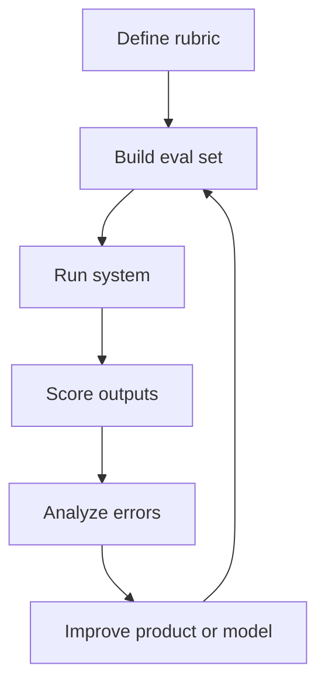

# Evaluation Design

Most AI features fail in one of two ways:

- the quality is weak
- no one can prove it clearly enough to make the right decision

The second problem is more common than teams admit.

A product team may have a promising assistant, grader, generator, search feature, or copilot. Stakeholders ask whether it is ready. Engineering says “it seems better.” Product says “users liked the demo.” Leadership asks for confidence. The team has no shared answer because evaluation was treated as a technical follow-up instead of a product design problem.

This section is about fixing that.

Good evaluation design tells you:

- what “good” actually means for the feature
- how to measure it consistently
- which errors matter most
- what data to test on
- how to track quality as the system changes

Without that, prompt iteration becomes guesswork, routing decisions become politics, and launch gates become subjective.

## The PM Lens

Evaluation is not only an ML concern. It is how product teams make decisions under uncertainty.

PM-owned evaluation questions include:

- Which failure type is most harmful to the user?
- Which quality threshold is required for launch?
- Which scenarios deserve dedicated test coverage?
- When is human review necessary?
- What tradeoff is acceptable between accuracy, latency, and cost?

If those questions are not answered, evaluation will produce data but not decisions.

## What This Section Covers

- [`SKILL.md`](./SKILL.md): guided workflow for designing an evaluation system
- [`frameworks/grader-agent-pattern.md`](./frameworks/grader-agent-pattern.md): using LLM graders to evaluate LLM outputs without fooling yourself
- [`frameworks/error-analysis.md`](./frameworks/error-analysis.md): how to categorize failures so the team knows what to fix
- [`frameworks/eval-data-strategy.md`](./frameworks/eval-data-strategy.md): how to build and maintain datasets that stay useful over time

## The Evaluation Loop

This is a product loop, not just a model loop. Sometimes the right fix is not a better prompt. It is a narrower scope, a better fallback, or a different UX.

## Default Recommendations

### Recommendation 1: Start with a rubric before you start with a dataset

If you do not know what counts as good, more examples will not save you.

### Recommendation 2: Use graders carefully, not blindly

LLM graders can save time and increase coverage, but only if you calibrate them against human judgment and understand where they drift.

### Recommendation 3: Error categories matter more than average scores

An average score of 4.1 is far less useful than knowing that the system fails mostly on multilingual queries, unsupported requests, or low-data cases.

### Recommendation 4: Version eval data like a product asset

If the dataset is invisible, stale, or overfit, it will slowly stop telling you the truth.

## When To Use This Section

Use it when:

- you are preparing launch gates for an AI feature
- prompt iteration is happening without clear improvement signals
- leadership asks whether the feature is “good enough”
- routing or model changes need a reliable before/after comparison
- user complaints are arriving, but failure patterns are still vague

Use it together with:

- [`../01-ai-prd-writing/`](../01-ai-prd-writing/README.md) to define the quality bar
- [`../03-model-strategy/`](../03-model-strategy/README.md) to compare model strategies
- [`../04-ai-agent-system-design/`](../04-ai-agent-system-design/README.md) to evaluate agent steps and failure points

If AI PM work needs an operating backbone, evaluation design is a big part of it.
