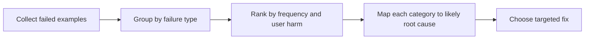

# Error Analysis

If evaluation tells you that quality is weak, error analysis tells you why.

Without error analysis, teams usually respond to failures the same way every time:

- try a new prompt
- switch models
- add more context

Sometimes those fixes help. Often they miss the actual failure mechanism.

## A Simple Error Analysis Flow

## Core Error Categories

Use categories that imply different product actions:

- misunderstanding user intent
- missing or weak grounding
- instruction-following failure
- unsupported request handling failure
- output format failure
- hallucinated facts
- low-confidence behavior expressed too confidently
- latency or timeout failure
- routing or tool-selection error

## Prioritization Matrix

| Category | Frequency | User harm | Fix urgency |
| --- | --- | --- | --- |
| Silent wrong answer | Medium | Very high | Immediate |
| Formatting issue | High | Low to medium | Moderate |
| Unsupported request mishandling | Low to medium | High | High |
| Minor tone mismatch | Medium | Low | Lower |

Frequency matters, but user harm matters more.

## Realistic Use Scenarios

### Scenario 1: Search Assistant

You discover that overall pass rate is acceptable, but a large share of negative feedback comes from silent dropping of one user constraint. That points to intent extraction and response validation, not general model weakness.

### Scenario 2: Support Copilot

The system fails disproportionately on policy-sensitive tickets. Error analysis shows retrieval noise rather than general drafting weakness. That changes the roadmap from “better model” to “better knowledge segmentation.”

## Questions To Ask Your Engineering Team

- What are the top 3 failure categories by user harm?
- Which categories seem tied to prompt issues versus data or routing issues?
- Are any categories increasing after recent changes?
- Which categories are visible to users versus only visible in traces?
- What fix type would each category suggest if we had to act this week?

## Anti-Patterns

### Failure Soup

All bad outputs are dumped into one bucket. What goes wrong: no prioritization and no targeted fixes.

### Frequency-Only Prioritization

The team fixes the most common minor issue before the less common but trust-damaging issue. What goes wrong: user harm persists.

### Premature Fixing

Teams jump to solutions before categorizing enough examples. What goes wrong: prompt churn without understanding.

## Red Flags

- Failure categories change every review because there is no stable taxonomy
- Teams argue about whether a failure is “just bad AI” instead of naming the category
- Error categories are not linked to owners or fix types
- No one can say which failures are launch blockers
- Examples are reviewed one by one without pattern synthesis

## Bottom Line

Error analysis should compress messy failures into a few high-signal categories that point toward different actions. If every failure suggests the same fix, your categories are too vague.
