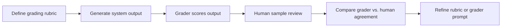

# Grader Agent Pattern

LLM graders can help evaluate LLM outputs at scale, but they are not magical truth machines. A grader is useful only when the criteria are explicit, the grader is calibrated, and the team knows where it fails.

## The Full Loop

## What A Good Grader Should Evaluate

A grader is best at dimensions with reasonably explicit criteria:

- groundedness
- relevance
- instruction following
- format compliance
- completeness against known requirements

Graders are weaker when:

- the rubric is vague
- brand nuance is subtle
- domain truth is hard to verify from the given context
- polished language can hide wrong facts

## Writing Grading Criteria That Stay Consistent

Strong criteria are:

- specific
- observable
- limited in number
- anchored by examples when possible

Weak criteria sound like:

- “sounds good”
- “is helpful”
- “is high quality”

Instead, define conditions such as:

- “mentions only facts supported by supplied context”
- “captures all mandatory user constraints”
- “follows required output structure”

## Measuring Grader Reliability

Do not deploy a grader into your main eval loop before checking:

- grader-vs-human agreement on a sample set
- where disagreement clusters
- whether the grader is systematically too lenient or too harsh

If disagreement is high on a dimension, either refine the rubric or remove that dimension from grader ownership.

## When Grader Agents Fail

Common grader failures:

- rewarding fluent but incorrect answers
- hallucinating reasons for a low score
- over-penalizing harmless style variance
- being inconsistent across similar examples

## Realistic Use Scenarios

### Scenario 1: Listing Description Review

A grader can check whether the description includes unsupported amenities or generic filler, but human review is still useful on brand tone until calibration is strong.

### Scenario 2: Search Explanation Quality

A grader can check whether the response captured the user’s stated constraints and avoided unsupported claims, but it may miss subtle domain errors if grounding is incomplete.

## Questions To Ask Your Engineering Team

- Which rubric dimensions are explicit enough for a grader today?
- What does grader-vs-human agreement look like on a representative sample?
- Where is the grader currently too lenient or too strict?
- Are we using grader outputs as a decision aid or as the sole truth source?
- How will grader prompt changes be versioned and tested?

## Anti-Patterns

### The Oracle Grader

The grader is treated as objective truth. What goes wrong: grader blind spots become product blind spots.

### The Vague Rubric

The grader is asked to evaluate “quality” broadly. What goes wrong: scores become inconsistent and hard to trust.

### The Hidden Calibration Gap

Human review is removed too early. What goes wrong: the team believes a score trend that is partly grader drift.

## Red Flags

- No grader-vs-human agreement number exists
- Grader rationale sounds polished but not grounded in the rubric
- Score changes after grader prompt edits are not tracked separately
- The grader is asked to judge dimensions humans also struggle to define clearly
- Teams use grader scores without category-level inspection

## Bottom Line

Use graders as scaled evaluators of explicit criteria, not as replacements for product judgment. Calibrate them, constrain them, and watch where they drift.
