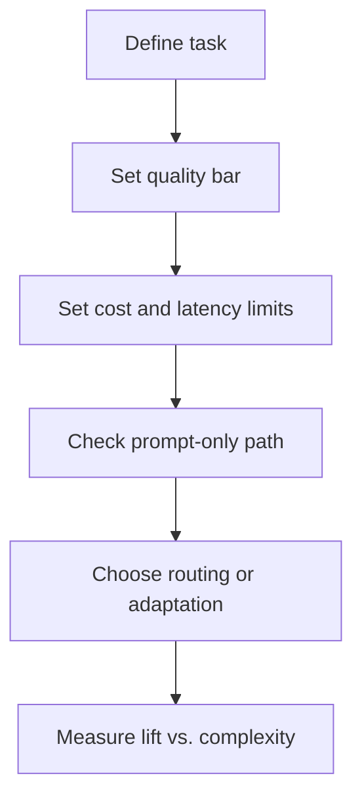

# Model Strategy

Choosing a model is not the same thing as having a model strategy.

A real model strategy answers a broader set of product questions:

- Should this feature even use AI yet?
- Is prompt engineering enough, or do we need retrieval, fine-tuning, or multiple models?
- When is routing worth the added complexity?
- Which step needs the best model, and which steps do not?
- What quality gain is worth paying for in latency and cost?

PMs often get pulled into model conversations late, after engineering has already narrowed the options. That is backwards. Model decisions affect the product experience directly: latency, quality consistency, localization performance, fallback behavior, unit economics, and even what promises you can safely make to users.

This section is about treating model strategy as a product decision framework, not a vendor shopping exercise.

## What This Section Will Tell You To Do

1. Start prompt-first unless you can show repeated evidence that prompt, context, and evaluation are plateauing.
2. Buy specialized capability before building custom adaptation unless the task is strategically core and your data advantage is real.
3. Route only when you can measure quality by tier and explain what happens when the cheap path fails.
4. Tie model quality to product risk, not engineering preference.
5. Refuse to discuss "best model" without first naming the quality bar, latency ceiling, and acceptable failure mode.

These are defaults, not balanced options.

## The Three Common Traps

### Trap 1: Buying model quality you do not need

Teams default to the strongest model everywhere because it feels safer. That often masks weak task design, inflates cost, and makes it harder to understand what capability is actually required.

### Trap 2: Underestimating prompt engineering

Some teams jump to fine-tuning or custom modeling too early when clearer task framing, better context, or stronger evaluation would solve the actual problem.

### Trap 3: Adding routing before proving it helps

Routing can save cost and protect latency, but it also adds failure modes. If you cannot measure whether the cheaper path is harming output quality, you do not have routing strategy. You have routing theater.

## What This Section Covers

- [`SKILL.md`](./SKILL.md): guided workflow for choosing a model strategy
- [`frameworks/build-vs-buy-vs-prompt.md`](./frameworks/build-vs-buy-vs-prompt.md): when to rely on prompts, buy external model capability, or invest in custom adaptation
- [`frameworks/model-routing.md`](./frameworks/model-routing.md): how to tier requests, route intelligently, and measure whether routing actually works
- [`frameworks/cost-latency-quality.md`](./frameworks/cost-latency-quality.md): the core trilemma and how to explain it to stakeholders

## The PM Lens

Model strategy should start with the feature, not the model.

Ask:

- what exact behavior needs to improve?
- what quality threshold matters for the user?
- what latency ceiling matters for the UX?
- what cost ceiling matters for the business?
- what failure path is acceptable?

Only then ask which model pattern fits.

## Default Recommendations

### Recommendation 1: Start simpler than you think

For many v1 features, the best path is:

- clear task definition
- strong prompt design
- grounded context
- evaluation loop

before custom training, elaborate routing, or multi-provider complexity.

Default rule:

- stay prompt-first until you have at least `2` meaningful iteration rounds with stable eval methodology and still cannot close the highest-priority gap
- do not escalate complexity based on demo disappointment alone

### Recommendation 2: Route only when the task naturally separates into tiers

Routing is most useful when requests are clearly distinguishable by difficulty, risk, or user value. If every request is equally hard or equally sensitive, routing may add more noise than benefit.

Default rule:

- if the cheap path cannot be monitored separately, do not add routing
- if fallback behavior is undefined, routing is premature

### Recommendation 3: Tie model quality to product risk

Higher-risk steps deserve stronger models, better validation, or stronger fallback logic. Low-risk extraction or triage steps often do not.

### Recommendation 4: Talk in tradeoffs, not absolutes

There is no universally “best” model strategy. There is only the right tradeoff for a specific product problem.

What strong tradeoff talk sounds like:

- "This premium model improves long-tail intent interpretation by `5.2` points, but adds `1.4s` to P95 latency and doubles unit cost."
- "This routing strategy saves `41%` on cost, but only if we accept a `2` point quality drop on low-value sessions."
- "This vendor solves Turkish speech recognition faster, but creates dependency risk we should revisit after launch."

## A Simple Sequence

If you skip straight to comparison shopping, you will make an architecture decision before you make a product decision.

## When This Section Helps Most

Use this section when:

- engineering asks whether you need a better model, cheaper model, or multiple models
- leadership wants cost savings without clear quality compromise rules
- a feature works in demo form but economics or latency do not scale
- prompt iteration is plateauing and the team needs to know what to try next
- the team is debating whether to fine-tune, route, or buy a specialized capability

## Bad Calls To Avoid

### Bad call 1: Premium everywhere because the team fears embarrassment

This usually means:

- weak task definition
- weak eval discipline
- no clear failure hierarchy

The result is often higher cost without better product control.

### Bad call 2: Build because buying feels strategically shallow

This usually means:

- the organization wants a moat before it has product clarity
- proprietary data quality is assumed, not proven

The result is a long infrastructure path chasing a still-moving target.

### Bad call 3: Routing for optics

This usually means:

- the architecture diagram looks sophisticated
- nobody can prove the cheap path is safe

The result is complexity without defensible economics.

## Use It With Other Sections

Model strategy works best when connected to:

- [`../01-ai-prd-writing/`](../01-ai-prd-writing/README.md) for task definition and launch criteria
- [`../02-evaluation-design/`](../02-evaluation-design/README.md) for proving quality differences
- [`../04-ai-agent-system-design/`](../04-ai-agent-system-design/README.md) when routing or orchestration becomes part of the product

If the task is vague, model strategy becomes speculation. If evaluation is weak, model strategy becomes opinion. This section assumes you are trying to make the tradeoff explicit and testable.
