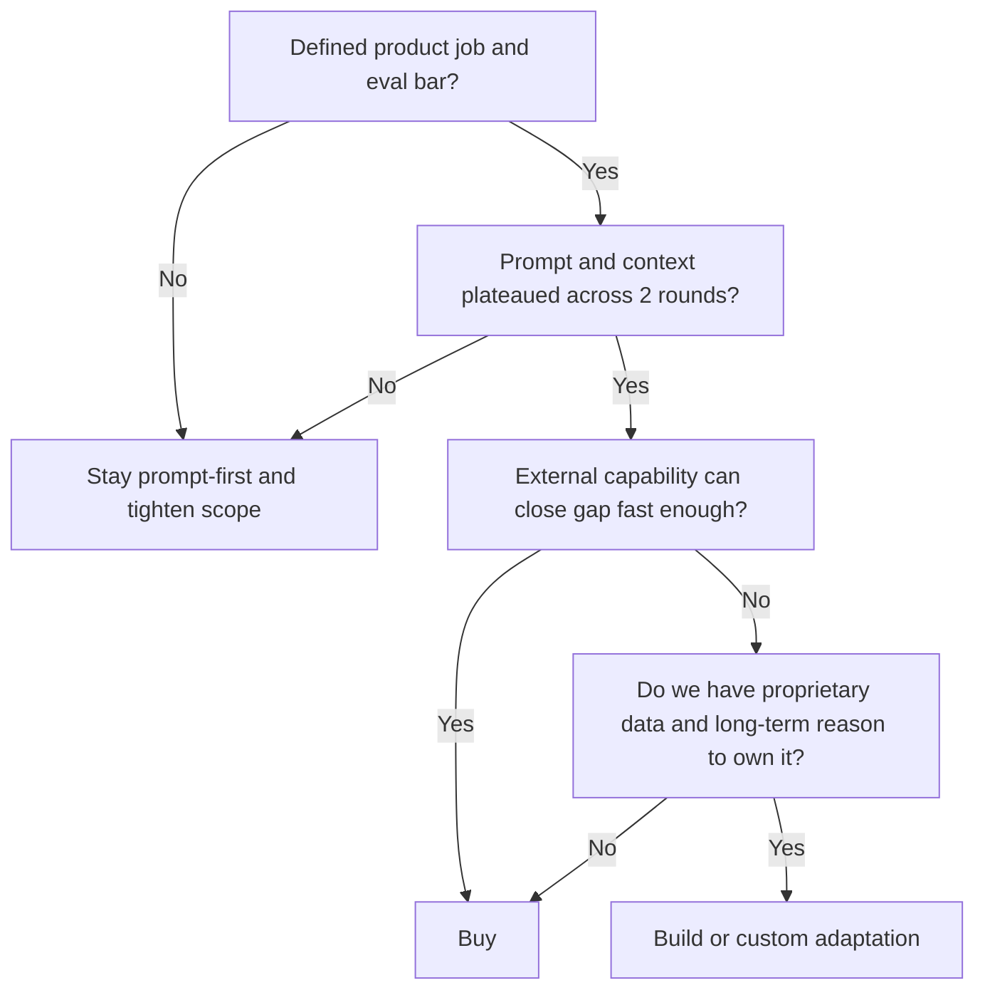

# Build vs. Buy vs. Prompt

This decision is usually framed too simply. The real question is not “should we fine-tune?” It is “what is the cheapest, fastest, most maintainable way to reach the quality bar for this product job?”

## Recommended Default

Start prompt-first. Buy before you build. Build only when you can defend all three of these claims at once:

1. prompt, context, and evaluation improvements have plateaued
2. you have reusable proprietary data that meaningfully fits the target task
3. the capability is strategically important enough to justify ongoing ownership

If you cannot defend all three, stay out of the build path.

## Decision Matrix

| Factor | Prompt-first recommendation | Buy / external capability recommendation | Build / custom adaptation recommendation |
| --- | --- | --- | --- |
| Data availability | Little or no high-quality labeled data | External provider already performs well on similar tasks | You have durable proprietary data and labeling discipline |
| Quality requirement | Prompt/context changes can plausibly reach bar | Specialized capability is needed quickly | Generic and vendor paths still miss a clear product-critical gap |
| Latency constraints | General-model latency is acceptable | Vendor meets a specialized latency requirement faster than you can | You can afford ongoing optimization and infra burden |
| Budget | Keep upfront cost and iteration cost low | Pay for speed-to-capability | Long-term investment is justified by scale or moat |
| Team capability | Limited ML specialization | Strong integration and evaluation capability | Team can own training, eval, maintenance, and rollback |
| Time-to-ship | Need the fastest learning loop | Need specialized launch speed | Willing to accept slower payoff for longer-term control |

## Threshold Heuristics

Use these as default gates. They are not universal, but they are far better than hand-wavy debate.

### Stay prompt-first when

- you have fewer than `2` disciplined prompt-and-context iteration rounds
- the task still lacks a stable eval set
- the quality gap is concentrated in unclear scope, weak grounding, or poor output contract
- you do not yet know which failure type actually blocks launch

### Move from prompt-first to buy when

- the task is clearly defined
- offline eval has plateaued across at least `2` rounds
- an external provider can close a known gap faster than your team can
- time-to-launch matters more in the next `1-2` quarters than long-term ownership

### Move from buy to build when

- vendor capability is becoming a product ceiling
- you have a high-volume, repeated task with reusable proprietary data
- the capability is core enough that sameness hurts your product strategy
- you are prepared to own evaluation, retraining, monitoring, and rollback continuously

## Quick Decision Flow

## When Prompt-First Is Right

### Scenario 1: Conversational Search Interpretation

You need strong intent extraction and grounded response behavior, but the task can be improved significantly through prompt design, context structure, and evaluation. Prompt-first is usually the right baseline.

### Scenario 2: Internal Content Summaries

If the task is bounded and internal, prompt quality and retrieval quality often matter more than custom modeling.

## When Buying Is Right

### Scenario 1: Voice Or Vision Capability You Need Quickly

If a vendor can provide robust real-time speech or domain-ready OCR faster than you can build it, buying is often the pragmatic choice.

### Scenario 2: Compliance Or Localization Support Exists Externally

If a provider is already stronger in your target language or domain format, buying may reduce risk faster than building.

## When Building Is Right

### Scenario 1: Proprietary High-Value Domain Data

You have enough domain examples and repeated task volume that custom adaptation could materially improve quality and economics over time.

### Scenario 2: Strategic Differentiation Depends On It

The capability is core enough that external sameness becomes a product ceiling, and the team can support the lifecycle.

## Bad Calls By Path

### Prompt-first bad call

What happened:

- the team kept adding prompt instructions for a retrieval-grounding problem

Why it failed:

- response fluency improved, but factual error rate did not

What to do instead:

- inspect source coverage and fallback behavior before another prompt round

### Buy bad call

What happened:

- the team bought a specialized vision service before defining which accuracy slice mattered

Why it failed:

- integration looked fast, but the vendor missed the specific false-negative profile that mattered to moderation

What to do instead:

- define eval slices and launch blockers before vendor selection

### Build bad call

What happened:

- the team began custom adaptation because leadership wanted a moat story

Why it failed:

- labels were noisy, the task kept changing, and the maintenance burden outpaced product learning

What to do instead:

- delay the build path until task definition and failure taxonomy stabilize

## Example Decision Record

### Feature: Listing Description Generation

| Question | Answer |
| --- | --- |
| Product bar | Reduce time-to-publish by `30%` without factual embellishment above `2%` |
| Prompt-first result after 2 rounds | Good tone, weak grounding on amenities and neighborhood claims |
| Buy option | External content model improved fluency but not factual grounding |
| Build option | Not justified; proprietary data existed, but labels on factual accuracy were weak |
| Decision | Stay prompt-first, tighten grounding rules, add deterministic fact validation |

That is a good model-strategy outcome. The right answer was not "pick a fancier model."

## Questions To Ask Your Engineering Team

- Have we proven prompt and context improvements are insufficient?
- Do we actually have enough high-quality data for custom adaptation?
- What ongoing maintenance burden would a custom path create?
- Could an external capability close the gap fast enough for the product timeline?
- What would success look like that justifies moving beyond prompt-first?
- What new maintenance burden appears if we pick the build path now?

## Anti-Patterns

### Build For Prestige

You pursue custom adaptation because it sounds strategic. What goes wrong: cost and complexity rise without clear product lift.

### Buy As A Shortcut Around Product Clarity

You purchase specialized capability before the task and quality bar are well defined. What goes wrong: integration happens faster than learning.

### Prompt Blame

You blame “the model” before improving inputs, context, or evaluation. What goes wrong: the team escalates complexity prematurely.

## Red Flags

- No one can articulate why prompt-first is insufficient
- Data quality is assumed rather than verified
- The main argument for building is future flexibility
- The team lacks a plan for ongoing eval and retraining
- Vendor choice is being driven by sales narrative rather than feature needs
- The argument for build depends more on future optionality than on a present product gap

## Bottom Line

Prompt-first is the default. Buy when it gets you specialized quality or speed faster. Build only when you have the data, the need, and the organizational discipline to make custom adaptation worthwhile.
