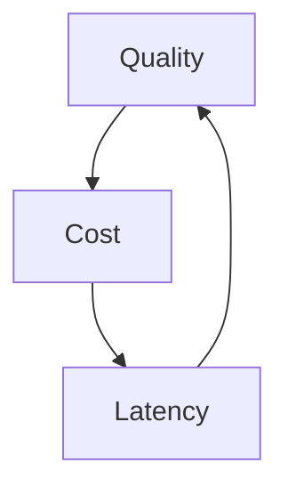

# Cost, Latency, Quality

This is the central trilemma of AI product management. You can improve all three a little, but when tradeoffs get real, optimizing one dimension usually puts pressure on the others.

## The Trilemma

Think of it as a product triangle:

- better quality often needs stronger models, richer context, or extra validation
- lower latency often means fewer hops, smaller context, or cheaper models
- lower cost often means simpler models, shorter outputs, or less retrying

## What Optimizing For Each Pair Looks Like

### Quality + Latency

You may need to spend more to keep responses both strong and fast. Example: voice assistants where premium low-latency inference is worth it because user patience is low and conversational awkwardness kills the experience.

### Quality + Cost

You may accept slower responses if the task is asynchronous. Example: listing-description generation where a slower offline review loop is acceptable if it improves content quality without premium real-time cost.

### Cost + Latency

You may accept lower output sophistication for routine or low-risk tasks. Example: simple intent extraction or FAQ classification where a cheaper, faster model is good enough.

## Stakeholder Talking Points

Use direct language when explaining this tradeoff to non-technical leaders:

- “If we want higher quality at the same speed, cost will probably rise.”
- “If we want lower cost without changing the experience, we need to prove that a cheaper path preserves quality.”
- “If we want faster responses, we may need to simplify the behavior or the amount of checking we do.”
- “This is not about model preference. It is about which tradeoff best fits the product and the customer expectation.”

## Realistic Use Scenarios

### Scenario 1: Consumer Search

Latency is visible and quality must stay credible. That often means medium-cost, medium-quality design with strong grounding and careful scope rather than premium reasoning everywhere.

### Scenario 2: Internal Report Drafting

Latency matters less than quality. The team can spend more time and more tokens because the workflow is asynchronous and human-reviewed.

## Questions To Ask Your Engineering Team

- Which dimension is currently the true bottleneck: cost, latency, or quality?
- What specific quality gain do we get from the slower or more expensive path?
- Which step contributes most to latency and spend?
- Can we reduce cost without affecting the user-visible part of the workflow?
- What user segment or task type deserves the premium path, if any?

## Anti-Patterns

### The Free Upgrade Myth

The team expects better quality with no meaningful effect on cost or latency. What goes wrong: planning becomes unrealistic.

### The Cost Panic Overreaction

Spend becomes the only lens and the team degrades user experience too far. What goes wrong: savings are achieved by quietly making the product worse.

### The Quality Absolutism Trap

The team keeps buying incremental quality lift even when users would not notice. What goes wrong: unit economics break for marginal gains.

## Red Flags

- Stakeholders ask for “faster, better, cheaper” without any tradeoff discussion
- The team cannot say which dimension matters most for this feature
- Quality is discussed abstractly rather than tied to user harm or value
- Tail latency is ignored in a conversational product
- Cost review happens only after rollout pressure appears

## Bottom Line

Pick the pair that matters most for the feature and be explicit about what you are giving up. Ambiguous tradeoffs create the worst outcomes because no one realizes which compromise has already been made.
