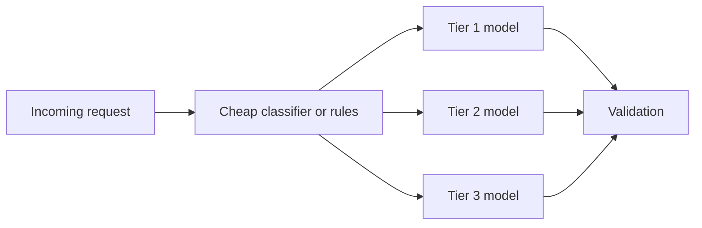

# Model Routing

Model routing is useful when different requests deserve different cost, latency, or quality treatment. It is harmful when the system cannot tell those requests apart reliably.

## How To Classify Requests Into Tiers

Common routing signals:

- token length or context size
- intent type
- user tier or account value
- risk level
- language complexity
- confidence from an upstream classifier

Example tiering:

- **Tier 1:** simple extraction or classification, low risk
- **Tier 2:** ordinary generation or explanation, medium risk
- **Tier 3:** complex, ambiguous, or high-stakes requests needing stronger reasoning

## Routing Flow

## When Routing Works Well

### Scenario 1: Search Intent Pipeline

Simple queries like “2+1 in Besiktas under X” can stay on a cheaper extraction path. Ambiguous or multi-intent queries can escalate to a stronger model for interpretation.

### Scenario 2: Support Copilot

Routine FAQ drafts can use a lower-cost model, while complaint, refund, or policy-sensitive cases route to stronger models or stricter validation paths.

## How To Measure Whether Routing Is Working

Track:

- cost savings relative to single-model baseline
- quality degradation by tier
- misrouting rate
- escalation rate
- user-visible fallback or complaint rate by route

Routing is successful only if cost savings exceed the operational and quality cost of added complexity.

## Fallback Chain Design

For each tier, define:

- what happens if the cheap model fails
- what happens if validation fails
- when to escalate to a stronger model
- when to stop and show fallback behavior instead of escalating further

Do not assume “send it to the bigger model” is always the right answer. Sometimes the product should clarify, narrow scope, or hand off instead.

## Questions To Ask Your Engineering Team

- What signals are reliable enough to separate easy from hard requests?
- How will we measure misrouting?
- Which tiers can tolerate quality loss, and which cannot?
- What is the latency impact of routing plus possible escalation?
- What is the fallback if routing confidence is low?

## Anti-Patterns

### Routing For Vanity Savings

You add routing to claim efficiency without measuring quality loss. What goes wrong: savings on paper, user harm in practice.

### Unclear Tiers

No one can explain what makes a request “hard.” What goes wrong: routes drift and debugging becomes subjective.

### Automatic Escalation Everywhere

Every failure goes to the largest model. What goes wrong: the expensive path becomes the real default and routing value disappears.

## Red Flags

- Tier definitions are hand-wavy
- Misrouting is not measured directly
- Cheap-path failure simply masks itself through silent escalation
- Quality review is aggregated across all tiers, hiding weak routes
- The routing classifier costs so much that savings disappear

## Bottom Line

Route only when requests naturally separate into tiers and you can measure the tradeoff. If not, simpler model strategies are usually better.
