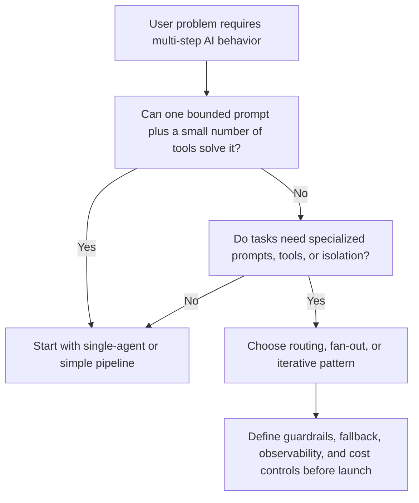

# AI Agent System Design

Most teams do not need an agent system as early as they think.

They need one of three things:

- a clearer task boundary
- a better prompt and evaluation loop
- a small number of well-designed tool calls wrapped in a simple flow

“Agent” language often arrives before the product problem is properly scoped. A PM hears that an assistant should reason, plan, call tools, retry, and coordinate specialists. Engineering starts sketching routers, sub-agents, and orchestration layers. Six weeks later the team has more moving parts, higher latency, and new failure modes, but the core user problem is only marginally better solved.

This section exists to prevent that outcome.

From a PM perspective, agent architecture is not an engineering style choice. It is a product decision with direct consequences for:

- reliability
- latency
- user trust
- observability
- cost
- ability to iterate
- operational burden after launch

If you choose a multi-agent pattern too early, you create complexity tax. If you choose a single-agent pattern where error isolation or tool specialization actually matters, you create quality ceilings and debugging pain. The goal is not to sound sophisticated. The goal is to pick the simplest architecture that can deliver the required behavior with acceptable cost and risk.

## What Counts As An Agent System

For this playbook, an agent system is any AI-powered workflow where the model does more than produce one direct output from one prompt. That includes:

- deciding which tool or source to use
- routing tasks across specialized prompts or sub-agents
- iterating through generate-review-retry loops
- managing multi-step workflows across structured and unstructured steps
- deciding when to stop, ask, retry, or hand off

That means some “simple assistants” are already agentic. It also means many systems marketed as “multi-agent” are really just pipelines with better branding.

## The PM Lens

Good PM questions for agent systems are different from engineering implementation questions.

Instead of asking:

- “Can we build a planner?”
- “Can we use multiple agents?”
- “Can the model call more tools?”

Ask:

- What user problem requires orchestration rather than a single step?
- Where would a wrong decision damage trust most?
- What latency budget can the user actually tolerate?
- Which step is hardest to observe and debug?
- Which part of the workflow should remain deterministic?
- Where do we want specialization, and where do we want simplicity?

## The Core Decision Flow

The default recommendation is simple:

- start with the least complex architecture that can meet the product requirement
- add orchestration only when it clearly improves quality, control, or maintainability
- treat every added agent, tool, or retry loop as a product tradeoff, not free capability

## What This Section Covers

- [`SKILL.md`](./SKILL.md): guided workflow for deciding whether and how to design an agent system
- [`frameworks/single-vs-multi-agent.md`](./frameworks/single-vs-multi-agent.md): when multi-agent architecture is justified and when it is overkill
- [`frameworks/agent-pipeline-patterns.md`](./frameworks/agent-pipeline-patterns.md): the main orchestration patterns and their tradeoffs
- [`frameworks/tool-and-mcp-design.md`](./frameworks/tool-and-mcp-design.md): how to think about tools, schemas, and tool boundaries as product decisions
- [`frameworks/guardrails-and-routing.md`](./frameworks/guardrails-and-routing.md): input validation, output validation, safety layers, and fallback routing
- [`frameworks/token-cost-optimization.md`](./frameworks/token-cost-optimization.md): practical cost control without damaging user experience
- [`frameworks/agent-observability.md`](./frameworks/agent-observability.md): what to log, measure, and review
- [`frameworks/agent-failure-modes.md`](./frameworks/agent-failure-modes.md): failure taxonomy and mitigation
- [`examples/conversational-search-agent.md`](./examples/conversational-search-agent.md): marketplace search pipeline example
- [`examples/content-generation-agent.md`](./examples/content-generation-agent.md): generation plus self-review loop example
- [`examples/support-copilot-agent.md`](./examples/support-copilot-agent.md): retrieval, drafting, and human handoff example

## Opinionated Recommendations

### Recommendation 1: If a single agent with bounded tools works, prefer it

Multi-agent systems create more states, more routing errors, more debugging cost, and more latency. Do not buy that complexity without a specific reason.

### Recommendation 2: Keep retrieval, policy, and critical business logic deterministic where possible

The model should not decide everything. The PM should define where deterministic rules protect trust and where the model’s flexibility actually adds value.

### Recommendation 3: Design the fallback path at the same time as the orchestration path

An impressive orchestration diagram is useless if the product has no graceful behavior when one step fails, times out, or produces low-confidence output.

### Recommendation 4: Do not separate architecture from observability

If you cannot see what each step did, which tool failed, or where cost spiked, you do not have a scalable agent system. You have a black box with a roadmap problem.

## When This Section Is Especially Useful

Use this section when:

- your current AI feature has become multi-step and hard to reason about
- the team is debating whether to split tasks into multiple agents
- costs or latency are rising as prompts grow
- failures are hard to diagnose because multiple tool or model steps are involved
- leadership wants “agentic” behavior and you need to distinguish real value from architectural theater

Use another section first when:

- the product behavior is still underdefined: start with AI PRD writing
- the real problem is output quality measurement: start with evaluation design
- the main issue is model choice rather than orchestration: start with model strategy

## The Standard Of A Good Agent Design

A strong agent design is not the most elaborate one. It is the one that:

- solves the user problem with the fewest moving parts
- isolates the riskiest decisions
- makes latency predictable enough for the UX
- fails visibly and gracefully
- can be monitored and improved without heroics

That is the standard the rest of this section uses.
