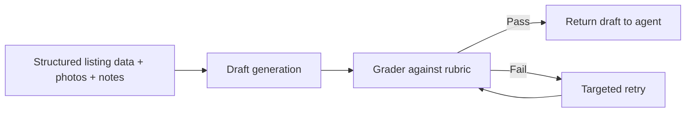

# Example: Content Generation Agent For Listing Descriptions

## Scenario

A marketplace supply team wanted to reduce the time agents spent writing listing descriptions. The team:

- 1 AI PM
- 1 designer
- 2 backend engineers
- 1 content operations lead

Timeline: 6 weeks to limited agency pilot.

Constraints:

- generation could be asynchronous, up to 30 seconds
- output had to remain editable by the agent
- descriptions needed to feel useful and differentiated, not generic
- hallucinated claims about neighborhood, legal status, or amenities were unacceptable

The feature goal was not “write poetic copy.” It was “produce accurate, helpful listing descriptions that save agent time without damaging listing trust.”

## The Chosen Pattern

The team chose an iterative refinement pattern:

The PM rejected a broader architecture with separate “marketing writer,” “SEO writer,” and “quality editor” agents.

## Why The Team Rejected The Specialist-Agent Idea

The output needed one thing above all else: grounded usefulness. Three specialist personas would likely create:

- more latency
- more style drift
- more chances to invent details
- more debate over who owned final behavior

Instead, the PM defined one content objective and one rubric:

- factually grounded in listing inputs
- concise and readable
- differentiates the listing without exaggeration
- avoids generic filler
- follows output structure rules

That made iterative refinement a better fit than role-based multi-agent collaboration.

## Step-By-Step Walkthrough

### Step 1: Draft Generation

Inputs:

- structured listing fields
- image-derived tags where reliable
- optional agent notes

The generation prompt emphasized:

- grounded facts only
- no mention of unsupported amenities
- no superlatives without evidence
- clear paragraph structure

**Decision made:** generation prompt treated missing facts as missing, not as invitations for elegant inference.

### Step 2: Grader Review

The grader scored output across:

- factual grounding
- completeness relative to available data
- readability
- duplication or filler
- policy compliance

**Decision made:** grader was allowed to fail a draft for unsupported claims even if the text sounded strong.

**Reasoning:** in listing content, polished hallucinations are worse than dry accuracy.

### Step 3: Targeted Retry

If the grader failed the draft, the retry prompt included:

- failed dimensions only
- concrete correction instructions
- no full re-brief unless necessary

**Decision made:** cap retries at one for v1.

**Reasoning:** the second pass improved quality meaningfully, but third-pass gains were small compared to cost and delay.

## What Went Wrong

### Problem 1: The Grader Was Too Lenient On Generic Filler

Early drafts passed despite sounding interchangeable:

- “ideal for comfortable living”
- “offers a great opportunity”
- “located in a desirable area”

**Why it happened:** the rubric overemphasized factual correctness and underweighted specificity.

**Fix:** add a “generic language penalty” and require the draft to mention at least two concrete, differentiating facts from the listing.

### Problem 2: Retry Loop Repeated The Same Mistake

When a draft invented a balcony, the retry often removed the balcony sentence but still kept an inflated tone.

**Why it happened:** the retry prompt corrected the specific false claim but not the underlying style tendency.

**Fix:** pass both the failed claim and the style warning into the retry step.

### Problem 3: Photo Inputs Added Noise

The team initially passed broad image descriptions into generation. This caused the model to write speculative visual claims.

**Why it happened:** image signals were treated as equally trustworthy as structured fields.

**Fix:** only pass image-derived features above strict confidence thresholds and label them as optional evidence, not primary truth.

## Why This Pattern Was Right

The iterative pattern worked because:

- the task had clear quality dimensions
- one retry created meaningful lift
- the user could tolerate async generation
- output review could be automated enough to reduce manual ops burden

A more complex multi-agent structure would have increased style variance without solving the core trust problem.

## Specific Decisions And Their Rationale

### Decision: One generator, one grader

This kept ownership of behavior clear and made failure analysis straightforward.

### Decision: One retry maximum

This protected cost and turnaround time. Agents cared about publish speed almost as much as copy quality.

### Decision: Agent remains final approver

This preserved user control and prevented over-automation in a trust-sensitive publishing flow.

## Lessons Learned

### 1. Content generation quality is usually constrained more by rubric quality than by agent count

If the rubric is weak, adding more “writers” just creates more noise.

### 2. Retry loops only pay off when the failure feedback is specific

Generic feedback produces generic retries.

### 3. Multimodal input should enter conservatively

If image signals are noisy, they should influence suggestions carefully, not drive confident prose.

### 4. User editability is part of the product strategy

The goal was not to replace agents. It was to reduce blank-page effort while keeping trust high.

## Transferable Takeaway

For generation workflows, start with:

- one grounded generator
- one explicit grader
- one tightly scoped retry

Only add more collaboration patterns if a clear, measurable quality gap remains after that.
