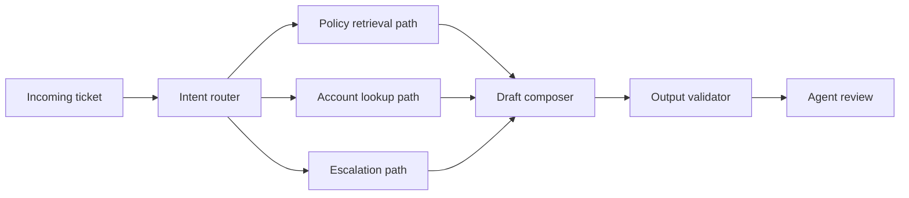

# Example: Support Copilot Agent For Customer Service Teams

## Scenario

A marketplace support organization wanted an internal copilot for agents handling chat and email tickets. The goal was to reduce response drafting time while increasing policy consistency.

Team:

- 1 AI PM
- 1 support operations manager
- 2 backend engineers
- 1 knowledge management lead
- 1 designer

Timeline: 10 weeks to internal pilot.

Constraints:

- the system was internal, so slightly more latency was acceptable than in consumer chat
- answers had to stay grounded in current policy and ticket context
- agents remained final senders
- policy mistakes on refunds, account restrictions, or legal complaints were high risk

## Initial Temptation

The first concept was a broad support assistant that would:

- classify the ticket
- retrieve knowledge
- look up account state
- draft the reply
- decide escalation
- summarize next steps

All inside one assistant prompt.

The PM pushed back. The product needed controllable specialization because not all support questions carried the same risk.

## Final Architecture

This was a router-based workflow with deterministic routing rules for the highest-risk categories.

## Step-By-Step Walkthrough

### Step 1: Intent Routing

The router categorized tickets into:

- policy question
- account-specific status issue
- refund or complaint
- unclear or mixed intent

**Decision made:** high-risk categories such as refunds used deterministic rules plus stricter validation, not purely model-based routing.

**Reasoning:** a refund misroute is not just a classification miss. It can create policy-breaking suggestions downstream.

### Step 2: Retrieval And Lookup

The system split knowledge retrieval from account lookup.

- policy retrieval pulled approved knowledge content
- account lookup returned live customer or order status

**Decision made:** these were separate tool paths, not one giant support tool.

**Reasoning:** failure handling differed. Missing policy content is different from account-service timeout, and the product needed different fallback behavior for each.

### Step 3: Draft Composition

The draft composer merged:

- ticket context
- retrieved policy
- account state when available
- brand tone rules

**Decision made:** draft only what is grounded. If account state is missing, the reply must say that the agent should verify or escalate, not improvise.

### Step 4: Output Validation

Validation checked:

- whether policy citations were present for high-risk categories
- whether the response implied action authority the agent did not have
- whether required disclaimers or escalation language were missing

**Decision made:** responses could be blocked from one-click insertion if validation failed, but agents could still open the underlying sources manually.

## What Went Wrong

### Problem 1: Mixed-Intent Tickets Broke Routing Confidence

Some tickets combined complaint, refund request, and account access issue in one long message.

**Why it happened:** the routing categories were too clean for real support language.

**Fix:** add a mixed-intent path that prioritizes highest-risk category first and asks the agent to choose the primary drafting mode when needed.

### Problem 2: Retrieval Overload Hurt Draft Quality

The retrieval layer initially returned too many policy chunks.

**Why it happened:** the team optimized for “recall” in knowledge retrieval without considering drafting coherence.

**Fix:** limit retrieved content to the smallest sufficient source set and show agents the sources separately if they want to inspect more.

### Problem 3: Agents Distrusted Invisible Account Lookups

Agents were uncomfortable when the system referenced account status but they could not immediately see where it came from.

**Why it happened:** the product showed the draft before showing the supporting context.

**Fix:** expose source snippets and account-state references directly in the copilot panel, not only in trace logs.

## Why This Architecture Worked

The router pattern made sense because support intents were meaningfully different in both risk and required tools. A simple linear pipeline would have hidden too much category-specific behavior, while a broad single prompt would have created dangerous ambiguity around grounding and escalation.

## Specific Decisions And Rationale

### Decision: Deterministic routing for highest-risk categories

This reduced misrouting on tickets where policy mistakes were costly.

### Decision: Separate policy retrieval from account lookup

This improved observability and made fallback behavior clearer.

### Decision: Human agent remains final sender

This kept the system assistive rather than autonomous, which was the right trust posture for internal support.

## Lessons Learned

### 1. Internal tools still need product-grade transparency

Agents adopt copilots faster when they can see why the draft says what it says.

### 2. Risk should shape routing logic

Not every category deserves the same routing freedom. High-risk support flows often benefit from more deterministic control.

### 3. Retrieval quality is not only about finding more information

Too much policy context can make the draft worse, not better.

### 4. Escalation logic is part of the copilot’s value

A support copilot that knows when to stop is more useful than one that drafts aggressively into unsafe territory.

## Transferable Takeaway

For internal copilots with mixed intents and high policy sensitivity, a router pattern with separate grounding paths is often the right middle ground between a single opaque assistant and an overbuilt multi-agent system.
