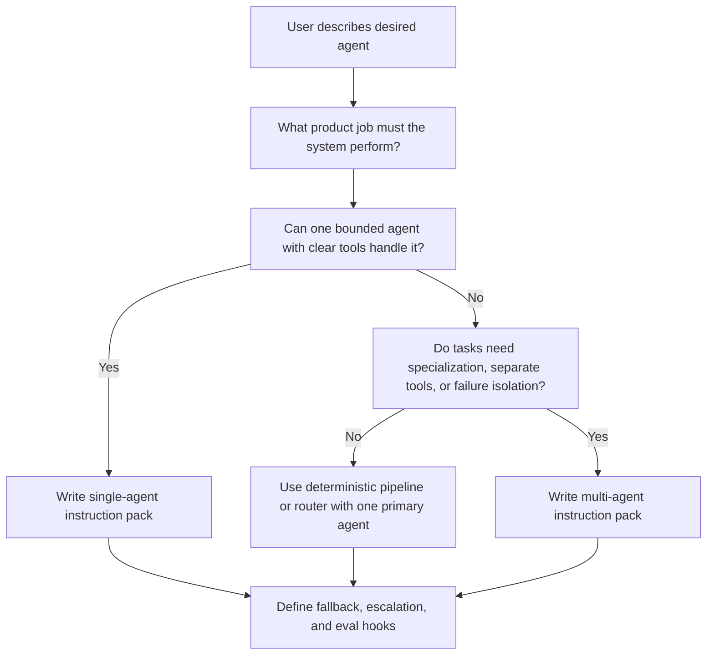

# Agent Instruction Pack

An agent instruction is not just a prompt. It is a behavior contract for a production workflow.

When a user says "I want an agent for X," the job is not to blindly draft a single long prompt. The job is to decide what kind of system the workflow actually needs, define the tool and handoff boundaries, and then write the right instruction set for that architecture.

That means the correct output is often an instruction pack, not one block of text.

## What This Artifact Should Contain

A strong agent instruction pack should include:

- architecture recommendation: non-agentic, single-agent, or multi-agent
- rationale: why this level of complexity is justified
- tool map: which tools exist, who can use them, and what each tool is for
- shared rules: grounding, refusal, escalation, and output expectations
- agent instructions: one instruction set for a single agent, or separate instructions for coordinator and specialists
- fallback behavior: what happens on ambiguity, tool failure, low confidence, or unsupported requests
- evaluation hooks: what should later be tested and monitored

## Default Rule

If the user says they want an agent, first figure out whether they need:

- a bounded single agent
- a deterministic pipeline with a small number of tool calls
- a true multi-agent workflow with specialized prompts, tool access, or failure isolation

Do not treat the user’s preferred architecture as automatically correct. Respect the intent of the workflow, but test whether simpler architecture can do the job.

## Decision Flow



## Inputs You Need Before Writing Instructions

Before drafting the instructions, pin down at least the following:

- the product job to be done
- the target user and context of use
- what actions, APIs, or data sources the system may access
- what must remain deterministic
- where trust damage is highest if the system is wrong
- latency and cost expectations
- when human review or escalation is required

If the workflow is still vague on these points, the instruction pack will look polished but stay weak.

## Workflow For Producing The Pack

### Step 1: Restate The Requested Agent Job

Write a one-paragraph summary of what the user wants the agent to do and what type of agent they believe they need.

This is useful because users often ask for a "multi-agent system" when they really need:

- one agent with better tool boundaries
- one generation step plus one deterministic checker
- one primary agent and one review loop

### Step 2: Challenge The Architecture

Ask whether one bounded agent can do the job with acceptable:

- quality
- control
- latency
- observability

Only escalate to multi-agent when specialization or isolation clearly matters.

### Step 3: Define Jobs Before Agents

Break the workflow into jobs before naming agents.

Good jobs:

- triage
- intent extraction
- retrieval
- execution
- validation
- drafting
- review
- escalation

Bad jobs:

- "smart assistant"
- "planner"
- "helper"

If the jobs are fuzzy, the agent roster will also be fuzzy.

### Step 4: Define Tool Boundaries

Before writing instructions, define:

- which tools exist
- what input each tool expects
- what output each tool returns
- which agent may call which tool
- which actions require confirmation, validation, or handoff

Multi-agent systems become unstable when every agent can call every tool with no product rule.

### Step 5: Write The Shared Rules Layer

Every instruction pack should include shared rules for:

- scope and non-goals
- grounding and evidence
- refusal and unsupported requests
- clarification versus acting
- confidence handling
- escalation and human handoff
- response formatting

In a multi-agent workflow, shared rules prevent the specialists from drifting into contradictory behavior.

### Step 6: Write The Architecture-Specific Instructions

For a single agent, define:

- role and job
- priority order
- allowed tools
- action policy
- output contract
- fallback behavior

For a multi-agent workflow, define:

- the coordinator or router role
- each specialist role
- allowed tools per agent
- handoff conditions
- retry or review policy
- final response ownership

### Step 7: Add Product Checks

End with a short checklist covering:

- likely failure modes
- which assumptions should be tested first
- what to evaluate before launch

Without this, the instruction pack looks complete but is not yet launchable.

## Recommended Output Shape

Use this output structure when generating an instruction pack.

### Section 1: Architecture Decision

- recommended pattern
- why that pattern fits
- why the simpler alternative is not enough
- why the more complex alternative is not justified yet

### Section 2: Workflow Jobs

- named workflow steps
- deterministic versus model-driven steps
- risk notes by step

### Section 3: Tool Map

For each tool:

- tool name
- product purpose
- caller
- input contract
- output contract
- validation or approval rule

### Section 4: Shared Policy Layer

Include:

- mission
- decision priorities
- non-goals
- grounding rules
- refusal rules
- fallback and escalation policy
- output style

### Section 5A: Single-Agent Instruction

If the recommendation is single-agent, produce one production-ready instruction with:

- role
- task boundary
- priority order
- allowed tools and tool-use rules
- response contract
- fallback behavior

### Section 5B: Multi-Agent Instruction Set

If the recommendation is multi-agent, produce:

- coordinator instruction
- specialist instruction for each agent
- handoff rules
- shared stopping conditions
- ownership of final answer

### Section 6: Eval And Launch Hooks

Include:

- top failure modes
- must-test scenarios
- step-level metrics to watch

## Single-Agent Template

Use a single-agent pack when one bounded agent can keep the job coherent.

```text
Architecture: Single agent with bounded tools

Why:
- The workflow is one primary job with manageable context.
- Tool use is limited and does not require specialist isolation.

Instruction:
You are the [agent role].

Primary job:
- ...

Priority order:
1. ...
2. ...
3. ...

Allowed tools:
- Tool A: use for ...
- Tool B: use for ...

You must not:
- ...

When to ask a clarification:
- ...

When to refuse or escalate:
- ...

Output requirements:
- ...
```

## Multi-Agent Template

Use a multi-agent pack when tasks genuinely diverge.

```text
Architecture: Coordinator plus specialists

Why:
- Different jobs require different prompts, tools, or risk controls.

Shared rules:
- ...

Coordinator:
- decides ...
- may use ...
- hands off when ...

Specialist A:
- owns ...
- may use ...
- returns ...

Specialist B:
- owns ...
- may use ...
- returns ...

Handoff rules:
- ...

Final answer policy:
- ...

Fallback and escalation:
- ...
```

## Common Failure Patterns

### The User Asked For Multi-Agent So We Gave Multi-Agent

What goes wrong:

- you lock in orchestration cost before proving the workflow needs it

What to do instead:

- restate the requested job and test the single-agent baseline first

### The Instruction Mentions Tools But Never Defines Them

What goes wrong:

- the prompt looks complete, but tool use stays underspecified and brittle

What to do instead:

- include caller, input contract, and validation rule for each tool

### Every Agent Has The Same Prompt With A Different Name

What goes wrong:

- there is no real specialization, only coordination overhead

What to do instead:

- split agents only when job, tool access, or success criteria differ materially

## Bottom Line

The right deliverable is usually not "a prompt." It is a decision-backed instruction pack that explains whether the workflow should be single-agent or multi-agent, which tools and rules belong to it, and how the system should fail when the work becomes ambiguous or unsafe.
