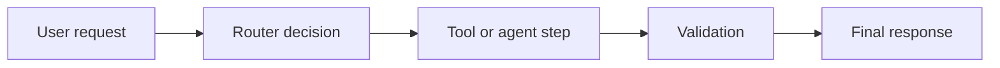

# Agent Observability

If you cannot see what each step of the agent system did, you cannot manage it as a product.

Agent observability is not only for debugging incidents. It is how PMs learn:

- where users are getting stuck
- where costs are rising
- which routing decisions are failing
- which tools are unreliable
- whether quality drift is happening in one step or across the whole flow

## What To Track

### Step-Level Metrics

- latency by step
- token usage by step
- tool call success rate
- retry rate
- validation failure rate
- route selection frequency

### End-To-End Metrics

- task completion rate
- user-visible fallback rate
- handoff rate
- end-to-end latency
- cost per task or conversation

### Quality Signals

- human review pass rate
- grader score by workflow step
- complaint tags by failure category
- low-confidence frequency

## Trace View Design

A useful trace should make it easy to answer:

- what path was taken
- which model or tool was used
- what the input and output shape looked like
- where latency accumulated
- what validation or guardrail fired
- why the user saw the final response they saw

## PM Rituals That Use Observability

- **Daily:** Review failures, spikes in fallback, and obvious regressions
- **Weekly:** Review routing mix, token trends, top failure categories, and tool reliability
- **Cycle-level:** Decide whether architecture simplification, model routing changes, or UX fallback redesign is needed

Observability only matters if it feeds decisions.

## Realistic Use Scenarios

### Scenario 1: Search Agent

The overall success rate looks stable, but trace review shows latency spikes come from clarification loops after ambiguous location extraction. That points to prompt and UX redesign, not search engine problems.

### Scenario 2: Support Copilot

Draft quality drops only for refund-related tickets. Trace review shows the retrieval tool is returning longer, noisier policy chunks for that category. The issue is context quality, not general writing ability.

## Questions To Ask Your Engineering Team

- Can we inspect the full path of a failed or escalated session end to end?
- Which step has the highest variance in latency or cost?
- How do we distinguish tool failure from model failure in traces?
- Can we segment traces by route, persona, or request type?
- Which observability metrics are action-driving versus vanity?

## Anti-Patterns

### Dashboard Without Decisions

There are many graphs, but no one knows what action each one should trigger. What goes wrong: observability becomes theater and drift goes unaddressed.

### End-To-End Only

Only final success or failure is measured. What goes wrong: you cannot tell which step actually needs work.

### No User-Facing Mapping

Technical traces exist, but they do not explain what the user experienced. What goes wrong: PMs cannot connect backend behavior to product trust or friction.

## Red Flags

- Failures are described as “the agent was weird”
- Trace review requires engineering heroics every time
- Token usage is tracked globally but not by route or step
- Guardrail and handoff triggers are not visible alongside outcomes
- PM rituals reference anecdotes more than trace data

## Bottom Line

Instrument the system so each important product question can be answered from traces and metrics. If a behavior matters enough to ship, it matters enough to observe.
