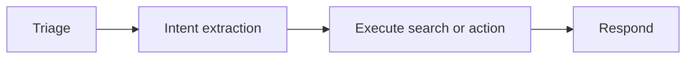
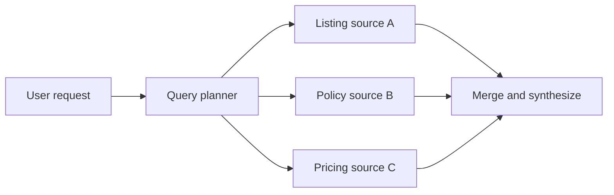
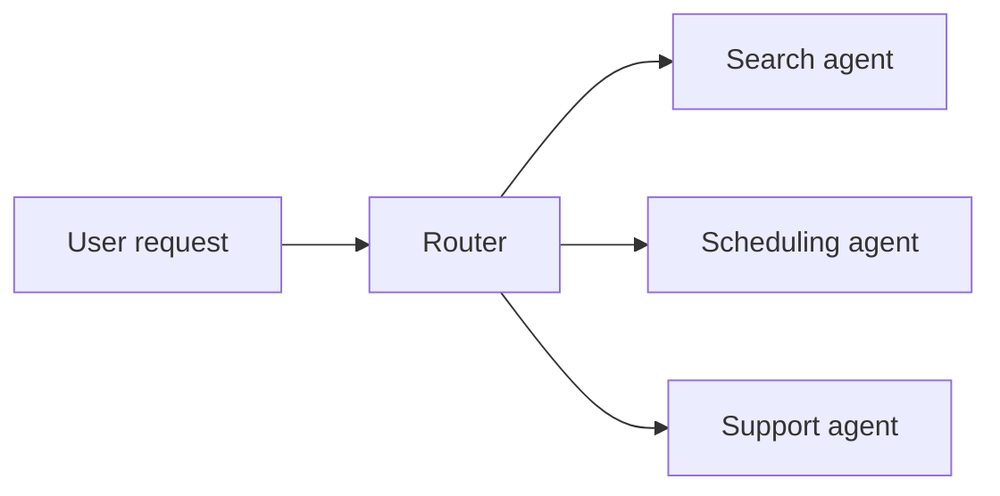
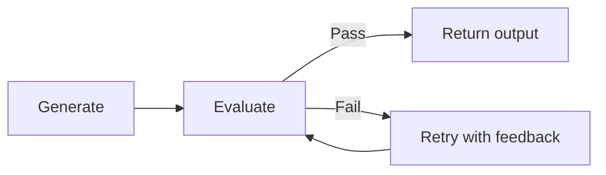

# Agent Pipeline Patterns

Most agent systems reduce to a small number of repeatable patterns. The PM job is to match the pattern to the product problem instead of inventing a new architecture for every feature.

## Pattern 1: Linear Pipeline

Best when the workflow has a predictable sequence and each step depends on the previous one.

- **When to use:** Search interpretation, form assistance, basic task automation
- **Latency implication:** Moderate and predictable if step count is low
- **Failure mode:** Early misclassification poisons downstream steps
- **Cost profile:** Reasonable if prompts stay narrow

## Pattern 2: Parallel Fan-Out

Best when multiple independent lookups or judgments can happen at once and then be merged.

- **When to use:** Comparing multiple data sources, gathering context from independent systems
- **Latency implication:** Better than serial if parallelism is real, but merge step still matters
- **Failure mode:** Partial results, inconsistent source quality, merge confusion
- **Cost profile:** Potentially high if every branch uses large-model reasoning

## Pattern 3: Router Pattern

Best when different request types need different logic, prompts, or tools.

- **When to use:** Multi-intent assistants, domain specialization, channel-specific workflows
- **Latency implication:** Good if routing is cheap and specialists are efficient
- **Failure mode:** Misrouting sends the user to the wrong expertise path
- **Cost profile:** Efficient if specialist prompts are smaller than one generalist blob

## Pattern 4: Iterative Refinement

Best when first-pass output quality is not reliable enough and review materially improves value.

- **When to use:** Content generation, complex drafting, rubric-based quality improvement
- **Latency implication:** Highest of the common patterns
- **Failure mode:** Cost spirals, endless retries, grader drift
- **Cost profile:** Potentially expensive, must be capped explicitly

## How To Choose

| If your product needs... | Prefer... |
| --- | --- |
| Predictable ordered steps | Linear pipeline |
| Multiple independent data pulls | Parallel fan-out |
| Clear request-type specialization | Router pattern |
| Quality improvement through review and retry | Iterative refinement |

## Realistic Use Scenarios

### Scenario 1: Property Search Assistant

Use a linear pipeline when the user message needs triage, intent extraction, search execution, and final explanation. Add a router only if scheduling or support intents are mixed into the same entry point.

### Scenario 2: Listing Description Generator

Use iterative refinement when a first draft is often acceptable but quality improves meaningfully with rubric-based review. Cap retries tightly or latency and cost will become unacceptable for agents publishing at scale.

## Pattern Tradeoff Summary

| Pattern | Strength | Main weakness |
| --- | --- | --- |
| Linear | Simplicity and traceability | Early-step errors cascade |
| Fan-out | Speed on independent tasks | Merge complexity and partial results |
| Router | Specialization and efficiency | Misrouting risk |
| Iterative | Higher output quality ceiling | Cost and latency can explode |

## Questions To Ask Your Engineering Team

- Which steps are truly dependent on prior steps, and which can run in parallel?
- How expensive is routing relative to the specialist work it enables?
- What happens if one branch in a fan-out pattern fails or times out?
- How many retry loops can we afford before user experience breaks?
- Can we inspect the output of each stage independently in traces?

## Anti-Patterns

### Pattern Soup

You combine router, fan-out, and iterative retry in v1 without proving each layer is necessary. What goes wrong: the system becomes hard to explain, slow to debug, and costly to run.

### Serial Work That Should Be Parallel

You run independent lookups one after another because the architecture grew organically. What goes wrong: avoidable latency accumulates and the experience feels slower than needed.

### Unbounded Iteration

You allow generate-evaluate-retry loops without strict caps. What goes wrong: cost spikes, latency grows, and the model may keep polishing the wrong thing.

## Red Flags

- The team cannot explain why a specific pattern fits better than another
- A merge step is doing too much hidden reasoning
- Router errors are not measured explicitly
- Fan-out branches use large models for simple retrieval work
- Retry loops have no hard stop

## Bottom Line

Do not invent a pattern. Choose the simplest known one that matches the product need, then measure whether its main weakness is acceptable in your context.
