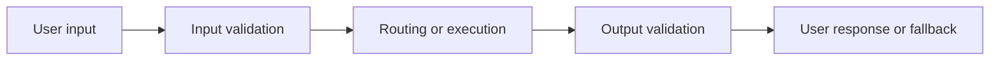

# Guardrails And Routing

Guardrails are not only safety features. They are the product’s way of deciding what the system is allowed to attempt, how it validates itself, and what users see when confidence is low.

## Guardrail Priority Matrix

| Guardrail category | Why it exists | Typical action |
| --- | --- | --- |
| Input relevancy | Stop unsupported or off-domain requests early | Refuse, reroute, or narrow scope |
| PII and sensitive data checks | Protect privacy and policy boundaries | Redact, block, or escalate |
| Prompt injection / instruction hijack checks | Preserve system integrity | Ignore malicious instruction, continue safely, or stop |
| Tool preconditions | Ensure action is actually possible | Ask for missing input or route to manual flow |
| Output grounding checks | Prevent invented claims | Retry, cite source, or downgrade response |
| Output format validation | Protect UI and downstream systems | Reformat, retry, or fallback |
| Safety / policy filters | Prevent harmful or prohibited content | Refuse or escalate |

## Where Guardrails Sit

PMs should define the user-facing behavior at each stage:

- what gets blocked
- what gets clarified
- what gets routed elsewhere
- what gets retried silently
- what gets surfaced transparently

## Routing As A Product Decision

Routing decides which path the request takes. That includes:

- which specialist agent or workflow handles it
- which model tier gets used
- whether the request is safe enough for automatic handling
- whether the system should ask, answer, defer, or hand off

Bad routing is not just inefficient. It is a user-trust problem because the product may sound confident while operating on the wrong path.

## Realistic Use Scenarios

### Scenario 1: Property Search Assistant

Input guardrails detect whether the request is actually about property search. If the user asks for mortgage advice or legal guidance, the product should narrow scope or redirect instead of pretending it can answer everything.

### Scenario 2: Support Copilot

Output guardrails validate that drafted responses do not claim unsupported refunds or policy exceptions. If grounding fails, the system should surface sources or route the draft for human review rather than sending a polished hallucination.

## PM Responsibilities

PMs should define:

- what kinds of user requests are supported
- which wrong answers are most dangerous
- what confidence thresholds trigger fallback or handoff
- how transparent the system should be about limitations
- which tradeoff matters more in each case: strictness or convenience

Engineering implements checks, but PMs own the product policy behind those checks.

## Questions To Ask Your Engineering Team

- What unsupported requests are common enough that we should route or message them deliberately?
- Which failures can be caught before tool execution versus only after output generation?
- What signals do we have for low confidence or likely hallucination?
- Which guardrails are deterministic today, and which are heuristic?
- What user-facing fallback do we show for each major guardrail trigger?

## Anti-Patterns

### The Hidden Refusal Stack

Guardrails fire, but the user only sees vague failure messages. What goes wrong: the product feels unreliable and arbitrary.

### The One-Size-Fits-All Threshold

The same confidence threshold governs every action. What goes wrong: low-risk interactions become too strict while high-risk ones remain too permissive.

### The Safety-Late Pattern

Validation happens only after the system already retrieved data, called tools, or generated a long output. What goes wrong: wasted latency, higher cost, and avoidable exposure.

## Red Flags

- Product cannot explain why a request was blocked, rerouted, or downgraded
- Guardrail triggers are not visible in traces
- Misrouting is not measured
- Low-confidence behavior defaults to confident language
- The team debates guardrails only after a bad incident

## Bottom Line

Guardrails and routing should be designed together. Decide early which requests deserve automation, which deserve narrowing, and which deserve refusal or handoff. The user experience of uncertainty is part of the product, not a technical afterthought.
