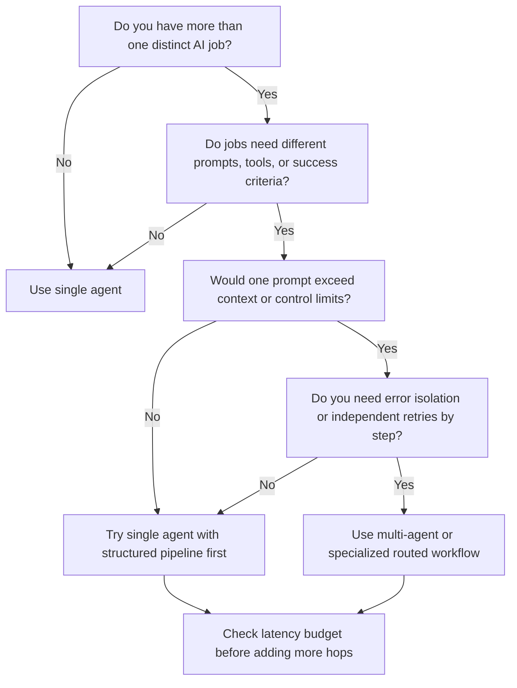

# Single Agent vs. Multi-Agent

The question is not “can we use multiple agents?” The question is “what specific problem becomes easier to solve if we do?”

Most teams should start with a single bounded agent or simple multi-step pipeline. Multi-agent design becomes worth it only when specialization, context isolation, tool separation, or independent failure handling clearly improve the product outcome.

## Decision Tree

## Practical Decision Matrix

| Criterion | Single agent is usually better when... | Multi-agent is usually better when... |
| --- | --- | --- |
| Task complexity | One bounded task dominates | Multiple distinct tasks have different logic |
| Number of tools | Few tools, simple choice | Many tools, specialized usage patterns |
| Context window | Shared context is manageable | Shared context becomes noisy or too large |
| Latency budget | User needs near-real-time response | User can tolerate longer or async flow |
| Error isolation | Step-level failure is tolerable | One bad step should not poison the whole flow |
| Maintainability | Team is early-stage or low-resourced | Team can observe and maintain orchestration |

## When A Single Agent Is The Right Call

Use a single agent when the job is coherent and the primary challenge is interpretation, not orchestration.

### Scenario 1: Conversational Search With Limited Tooling

A marketplace assistant interprets the user query, extracts intent, calls search, and explains results. If the search tool is stable and the main complexity is understanding the query, a single agent plus deterministic search execution is often enough.

### Scenario 2: Internal Drafting Copilot

An internal support copilot retrieves policy content, drafts a response, and asks the human to review it. If retrieval is deterministic and drafting quality is the main challenge, splitting into multiple agents may add little value.

## When Multi-Agent Starts Making Sense

Use multiple specialized agents or routed steps when task types meaningfully diverge.

### Scenario 1: Search + Financial Calculation + Scheduling

A real estate assistant must interpret user intent, query listings, compare mortgage scenarios, and schedule a visit. These steps have different tools, risk levels, and validation needs. Isolating them may reduce both errors and debugging pain.

### Scenario 2: Content Generation With Automated Review

A listing-description workflow generates draft copy, scores it against a rubric, retries with targeted instructions, and only then sends it to the user. The generation and grading jobs have different prompts, success criteria, and failure modes.

## The Real Cost Of Multi-Agent

Each added agent or step increases:

- latency
- token usage
- routing failure risk
- trace complexity
- evaluation surface area
- operational overhead

That is acceptable only if you get something meaningful back, such as better quality on a high-value task, clearer failure isolation, or maintainability that a single-agent blob cannot provide.

## Over-Engineering Patterns To Watch For

### Pattern 1: “Specialist” Agents With No Real Specialization

If three agents use nearly the same prompt, same model, and same tools, you probably do not have real specialization. You have administrative overhead.

### Pattern 2: Planner For A Stable Flow

If the sequence is predictable every time, you may not need planning. Deterministic orchestration is often safer and cheaper.

### Pattern 3: Multi-Agent As A Proxy For Weak Specs

Teams sometimes add more agents because one prompt is underperforming, when the real issue is that the task boundary and quality rubric are unclear.

## Questions To Ask Your Engineering Team

- Which step genuinely needs a different prompt, model, or tool set?
- What would break if we kept this as a single-agent flow for v1?
- Where does context become too large or too noisy in the current design?
- Which failure would be easier to detect or retry if the workflow were split?
- How much latency does each added model hop introduce in practice?

## Anti-Patterns

### The Prestige Architecture

You choose multi-agent because it signals sophistication to leadership. What goes wrong: the team spends time on orchestration instead of user value, and debugging becomes slower.

### The Monolith Disguised As Multi-Agent

You split the system into multiple agents on paper, but they all share prompts, context, and tools. What goes wrong: you pay coordination cost without gaining specialization or control.

### The Latency Blind Spot

You design a multi-step flow without user-facing latency discipline. What goes wrong: the experience feels laggy, retries compound delay, and trust falls even when final answers are acceptable.

## Red Flags

- The strongest rationale is “this will be more flexible later”
- No one can explain which step benefits from specialization
- The team cannot estimate per-step latency or cost
- Routing is probabilistic, but the consequences of misrouting are not understood
- Observability is still end-to-end only

## Bottom Line

Default to a single bounded agent or simple deterministic pipeline. Move to multi-agent only when task specialization, context isolation, or failure isolation clearly improves the product and the team can absorb the operational cost.
