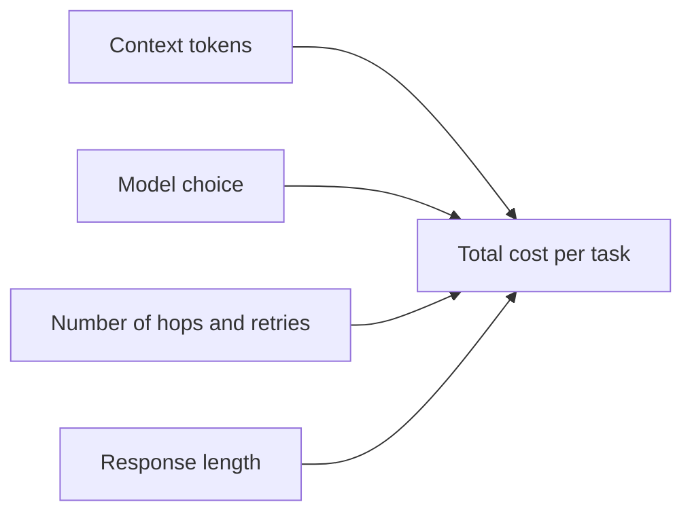

# Token Cost Optimization

Token cost is not a finance-only problem. It shapes product viability, rollout scope, and user experience. A PM working on agent systems should know the main cost levers and decide where spend actually creates user value.

## The Core Cost Equation

In agent systems, cost rises fastest when all four levers grow at once.

## Practical Levers

### 1. Prompt Caching

Useful when:

- large system instructions repeat often
- retrieval context is stable across similar sessions
- many tasks share the same scaffolding

PM angle: cache what is genuinely reusable, but do not assume cached context means relevant context. Old context still creates quality risk.

### 2. Context Window Management

Useful when:

- conversation history grows long
- multiple tools return verbose payloads
- the system keeps stuffing traces back into the next prompt

PM angle: decide what context is actually necessary for the user goal. More context can reduce quality if it dilutes the signal.

### 3. Response Length Control

Useful when:

- outputs tend to be verbose
- most user value comes from concise next-step guidance

PM angle: short answers often feel faster, clearer, and cheaper. Do not pay for eloquence users did not ask for.

### 4. Model Routing

Useful when:

- some steps are simple classification or extraction
- stronger models are only needed for a minority of hard cases

PM angle: reserve expensive models for the steps that actually drive perceived quality or trust. A high-end model used everywhere is often lazy architecture, not strategy.

### 5. Batching And Parallelism

Useful when:

- independent low-risk tasks can be processed together
- offline or asynchronous review flows exist

PM angle: batching helps more in background operations than in real-time UX. Do not sacrifice perceived responsiveness for backend neatness.

## Cost Per Conversation Framework

Estimate:

1. average number of model calls per task
2. average input tokens per call
3. average output tokens per call
4. retry rate
5. share of traffic using expensive model tiers

Then calculate:

`cost per conversation = base path cost + retry cost + fallback path cost + review loop cost`

This matters because the average path often looks fine while the tail path quietly destroys unit economics.

## Realistic Use Scenarios

### Scenario 1: Conversational Search

Keep the extraction step cheap and short. Use stronger generation only if explanation quality actually improves measurable user outcomes. Avoid sending full listing payloads back into multiple prompt hops.

### Scenario 2: Content Review Loop

A generation workflow with self-review can become expensive fast. Cap retry loops, keep rubric prompts tight, and measure whether the second pass creates enough quality lift to justify the cost.

## Questions To Ask Your Engineering Team

- Which step currently drives the most token usage?
- Are we sending more context than the model actually needs to perform the task?
- Which requests truly need the expensive model tier?
- What is the cost impact of retries and fallback paths, not just the happy path?
- Which cost metrics can we review weekly at the PM level?

## Anti-Patterns

### The “Context Is Cheap” Assumption

Teams keep adding logs, retrieval payloads, and prior messages. What goes wrong: spend rises while quality may actually fall from noise.

### The Premium Model Default

Every step uses the strongest model. What goes wrong: costs balloon and the team never learns which steps actually need premium capability.

### The Invisible Retry Spend

Retries are added for reliability but not tracked transparently. What goes wrong: unit costs drift upward until rollout scope must be cut.

## Red Flags

- No one can estimate cost per conversation within a useful range
- Tail-path costs are unknown
- Token dashboards exist but are not tied to product decisions
- Context keeps growing because removing it feels risky
- Response verbosity is not an explicit product choice

## Bottom Line

Optimize for value density, not just lower spend. Spend more where it protects trust or meaningfully improves outcomes. Cut ruthlessly where extra tokens only create architecture vanity.
