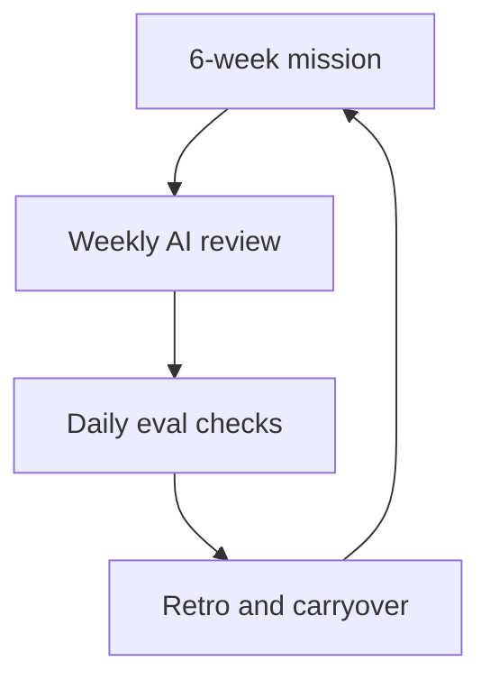

# AI Team Operations

AI product work breaks the default operating model of many product teams.

A normal product cadence assumes that:

- requirements become clearer over time
- implementation progress is mostly linear
- quality is largely deterministic
- the team can estimate confidence from completion percentage

AI work does not behave that neatly.

You can build a lot and still not know whether the output quality is good enough. A prompt change can improve one category and regress another. A feature can look strong in demos and still create operational pain at launch. Scope creep is especially common because teams keep discovering new edge cases, fallback needs, and evaluation gaps.

That means AI teams need a different operating rhythm.

This section is about that rhythm: how to run missions, assign decision rights, review the right data, build adoption across non-technical functions, and communicate AI progress honestly without sounding either defensive or naive.

## What This Section Covers

- [`SKILL.md`](./SKILL.md): guided workflow for setting up or improving AI team operations
- [`frameworks/mission-cycles.md`](./frameworks/mission-cycles.md): how to run 6-week AI missions without drowning in ambiguity
- [`frameworks/daci-for-ai.md`](./frameworks/daci-for-ai.md): decision rights for models, prompts, evals, and launch gates
- [`frameworks/pm-data-rituals.md`](./frameworks/pm-data-rituals.md): daily, weekly, and cycle-level review habits
- [`frameworks/ai-native-culture.md`](./frameworks/ai-native-culture.md): building AI-first behavior in teams that still think in traditional delivery patterns
- [`frameworks/ai-adoption-playbook.md`](./frameworks/ai-adoption-playbook.md): driving adoption through practical project-based learning
- [`frameworks/stakeholder-communication.md`](./frameworks/stakeholder-communication.md): how to explain AI progress, limitations, and tradeoffs to leadership
- [`templates/mission-brief-template.md`](./templates/mission-brief-template.md)
- [`templates/weekly-ai-review-template.md`](./templates/weekly-ai-review-template.md)
- [`templates/quarterly-ai-report-template.md`](./templates/quarterly-ai-report-template.md)
- [`examples/first-ai-mission.md`](./examples/first-ai-mission.md)
- [`examples/ai-adoption-workshop.md`](./examples/ai-adoption-workshop.md)

## The Default AI Team Failure Pattern

Many teams start AI work like this:

- one exciting demo
- no clear launch gate
- unclear ownership of prompt quality and evals
- scattered review of logs and bad outputs
- leadership updates framed as optimism instead of evidence

That works for about two weeks.

Then the questions start:

- Who decides whether the model is good enough?
- Why did quality drop after the last prompt change?
- Why are we spending this much on low-value traffic?
- Is this mission still on scope?
- What exactly did we learn this week?

If the operating model is weak, every one of those questions becomes a debate rather than a fast decision.

## The Recommended Operating Shape

The key idea is simple:

- mission cadence creates focus
- review rituals create signal
- DACI creates decision speed
- stakeholder communication creates alignment

## Opinionated Recommendations

### Recommendation 1: Run AI work in missions, not vague streams

AI work expands to fill every open question. A mission forces the team to define what must be proven in six weeks.

### Recommendation 2: Separate “build progress” from “quality confidence”

A team can be 80% through implementation and only 40% confident in feature quality. If you report only build progress, you create false confidence.

### Recommendation 3: Make eval review a PM ritual, not only an engineering task

If PMs are not reading failure categories, flagged outputs, and trend shifts, the roadmap gets detached from reality.

### Recommendation 4: Treat adoption as a product problem inside the company

Internal AI usage does not spread because you announce a tool. It spreads when people learn through concrete tasks with visible value.

## Who This Section Is For

Use it if you are:

- the PM running an AI mission
- the product lead designing how multiple teams will work on AI features
- a founder or head of product trying to create decision discipline around AI
- a PM asked to “own AI” without an operating system to do it

AI team operations are often the difference between one flashy launch and a repeatable capability. This section is about building that repeatable capability.
