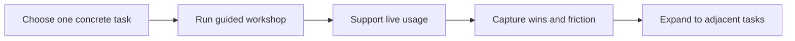

# AI Adoption Playbook

Internal AI adoption usually fails when the rollout is abstract.

People do not change behavior because you announce a tool. They change behavior when the tool helps them complete one meaningful task faster, better, or with less friction.

## Adoption Sequence

## Recommended Adoption Model: Project-Based Learning

Instead of generic training, ask people to complete a real task in the session:

- rewrite a listing description
- summarize support tickets
- prepare a sales follow-up
- structure a product brief

This creates immediate relevance and exposes real friction.

## Realistic Use Scenarios

### Scenario 1: Support Team

A workshop asks agents to handle five real ticket types with the copilot. The value becomes tangible, and resistance shifts from “why would I use this?” to “how do we improve this specific weak case?”

### Scenario 2: Product Team

PMs use an AI PRD-writing skill on a live initiative rather than hearing a presentation about AI productivity in general.

## Questions To Ask Your Engineering Team And Internal Partners

- Which one task would create the clearest visible value for this group?
- What current friction or fear is blocking first use?
- What support is needed in the first two weeks after rollout?
- How will we capture real usage and friction, not just attendance?
- What adjacent use case should expansion target after the first task succeeds?

## Anti-Patterns

### The Generic Enablement Session

Everyone gets a broad AI talk. What goes wrong: interest rises briefly, behavior does not change.

### The All-At-Once Rollout

Too many teams and tasks are included initially. What goes wrong: support quality drops and proof points stay weak.

### The Feature List Pitch

Rollout focuses on capabilities rather than tasks. What goes wrong: users cannot translate the tool into their daily work.

## Red Flags

- Adoption is measured by logins instead of task completion
- Workshop attendees cannot name when they would use the tool tomorrow
- Managers push usage before value is visible
- Friction feedback is collected but not acted on
- Expansion begins before the first use case is solid

## Bottom Line

Teach one real task first, then expand. Adoption sticks when people experience concrete value, not when they are told to become AI-first.
