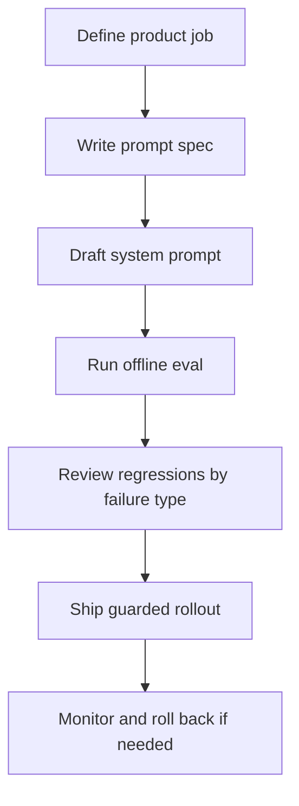

# Prompt Engineering For PMs

Prompt work gets dismissed as wording. In production AI products, that is wrong.

The prompt is often the fastest-moving behavior layer in the system. It determines what the model is allowed to infer, how much it should ask versus act, which fields it must return, when it should refuse, and how it should degrade when context is missing. If you change those rules, you changed the product.

That is why PMs need a stronger posture here. You should not be editing prompts sentence by sentence in production. You should be defining behavioral intent, reviewing prompt specs as product artifacts, and approving prompt changes with the same discipline you use for user-facing workflow changes.

## What This Section Covers

- [`SKILL.md`](./SKILL.md): guided workflow for prompt strategy, review, debugging, and rollout
- [`frameworks/prompt-as-product-spec.md`](./frameworks/prompt-as-product-spec.md): how to define the prompt as a product contract instead of invisible config
- [`frameworks/versioning-and-testing.md`](./frameworks/versioning-and-testing.md): how to evaluate, ship, and roll back prompt changes safely
- [`frameworks/prompt-review-checklist.md`](./frameworks/prompt-review-checklist.md): a structured review checklist before launch
- [`frameworks/system-prompt-design.md`](./frameworks/system-prompt-design.md): how to structure a production system prompt so behavior stays legible
- [`frameworks/prompt-debugging.md`](./frameworks/prompt-debugging.md): how to isolate whether a failure is prompt, model, context, or orchestration
- [`examples/listing-description-agent.md`](./examples/listing-description-agent.md): artifact-heavy example of multi-round prompt iteration with failure analysis
- [`examples/search-intent-extraction.md`](./examples/search-intent-extraction.md): artifact-heavy example of turning messy user language into stable structured search intent
- [`examples/content-grader-prompt.md`](./examples/content-grader-prompt.md): artifact-heavy example of building and tightening grader criteria

## What This Section Will Tell You To Do

1. Start with a prompt spec, not prompt prose.
2. Keep the prompt responsible for behavior and policy, not for rescuing bad product scope.
3. Do not ship a prompt change without offline eval and a rollback plan.
4. Use explicit fallback behavior instead of hoping the model will "be careful."
5. Stop adding more examples when the real problem is an unclear rule, weak context, or impossible task definition.

These are not balanced suggestions. They are defaults. Deviate only when you can defend why.

## The Operating Sequence

Teams get into trouble when they start at `Draft system prompt` and pretend the earlier steps are optional.

## Hard Defaults

### Default 1: PM owns the behavior contract

Engineering should own implementation reliability. The PM should own:

- what the feature is trying to do
- what it must never do
- what uncertainty looks like
- which failure is most harmful
- what the user sees when the model cannot comply

If nobody owns those decisions, the prompt turns into a pile of local fixes.

### Default 2: Prompt changes are product changes

If a prompt edit changes:

- which users get clarifying questions
- whether the model can infer missing fields
- how strict the refusal rule is
- whether the output fits the UI schema

then it deserves review, versioning, and measured rollout.

Treat "small prompt tweak" as suspicious language. Many teams hide behavior changes under that label.

### Default 3: Prompt-first does not mean prompt-only

Prompt-first is the right starting point for many AI features. It is not permission to stuff retrieval rules, routing policy, confidence logic, UI formatting rescue, and compliance handling into one giant prompt.

Use the prompt for:

- product behavior
- reasoning priority
- response structure
- uncertainty posture

Do not use the prompt to compensate for:

- missing source data
- broken schemas
- unresolved scope
- absent deterministic validation

### Default 4: Review failure slices, not average quality

A prompt that looks "better overall" can still be worse where it matters. PM review should be organized around slices like:

- ambiguous requests
- typo-heavy or localized inputs
- low-context requests
- policy-sensitive outputs
- high-value user cohorts

Average scores hide the failures that cause launch pain.

## Real Failures To Watch For

### Failure 1: Hidden product policy in engineering-owned prompt copy

What it looks like:

- PM reviews outputs but not the actual prompt contract
- escalation rules or scope boundaries live only in implementation text
- nobody can explain why the assistant asks follow-ups in one case but not another

What to do instead:

- require a prompt spec artifact before implementation
- map prompt sections to product decisions
- make launch review include actual prompt behavior, not just sample outputs

### Failure 2: Prompt-only fix for a retrieval or grounding problem

What it looks like:

- responses sound better, but remain wrong
- the team adds more "do not hallucinate" instructions every week
- grounding or evidence quality never materially improves

What to do instead:

- inspect the input context
- check whether source coverage is missing
- reduce scope or change fallback behavior if grounding is still weak

### Failure 3: Example bloat instead of rule clarity

What it looks like:

- prompt grows by hundreds of tokens every sprint
- few-shot examples contradict each other
- edge-case performance improves on known examples but worsens on live traffic

What to do instead:

- rewrite the rule
- cut or normalize examples
- move stable structure into deterministic validation where possible

## Review Questions PMs Should Ask

- What exact behavior changed between prompt version `v12` and `v13`?
- Which failure slice improved, and which one regressed?
- What is the launch blocker threshold for this prompt change?
- If the model is unsure here, what user experience are we explicitly choosing?
- Which behaviors belong in prompt, and which should move into validation, routing, or UI logic?

## When This Section Helps Most

Use this section when:

- the team has promising outputs but unstable behavior
- prompt changes are shipping faster than product review can keep up
- model performance feels "inconsistent" and nobody can name the failure type
- PM and engineering disagree on whether the issue is prompt, data, or model
- leadership thinks prompt work is polish rather than product-definition work

## Use It With Other Sections

Prompt work should stay aligned with:

- [`../01-ai-prd-writing/`](../01-ai-prd-writing/README.md) for behavior definition and launch criteria
- [`../02-evaluation-design/`](../02-evaluation-design/README.md) for prompt change measurement
- [`../03-model-strategy/`](../03-model-strategy/README.md) for deciding when prompt iteration has plateaued
- [`../07-ai-ux-patterns/`](../07-ai-ux-patterns/README.md) for user-facing fallback, confidence, and correction behavior

If those sections disagree with the prompt, the prompt is not the source of truth. It is a drift risk.
