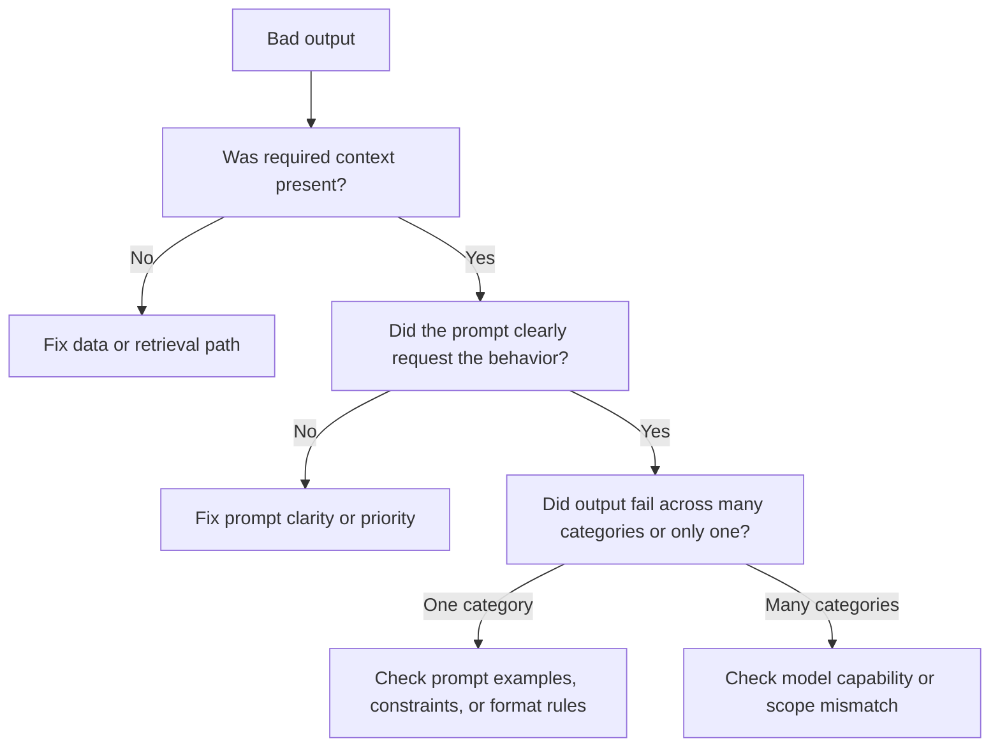

# Prompt Debugging

When an AI feature produces bad outputs, the prompt is often blamed first. Sometimes that is correct. Often it is not.

Prompt debugging works only when you isolate whether the problem is:

- prompt clarity
- model capability
- context quality
- retrieval or tool behavior
- product scope mismatch

## Debugging Decision Tree

## Common Failure Patterns

- instruction drift in long conversations
- conflicting instructions
- ambiguous phrasing
- context window overload
- unsupported task scope
- retrieval returning noisy or stale information

## Realistic Use Scenarios

### Scenario 1: Search Assistant Misreads Soft Preferences

The prompt says “prioritize helpful interpretation,” but never defines how to talk about unsupported lifestyle traits. The fix is prompt and product-boundary clarity, not a bigger model.

### Scenario 2: Support Draft Includes Wrong Policy

The prompt correctly says “ground in policy,” but retrieval returned the wrong policy snippet. The fix is not prompt wording. It is retrieval quality and validation.

## Questions To Ask Your Engineering Team

- Did the prompt explicitly ask for the missing behavior?
- Was required context actually present and relevant?
- Is the failure isolated to one task category or broad across all categories?
- Did a recent prompt change introduce conflicting priorities?
- Are we asking the prompt to solve a scope problem rather than a wording problem?

## Anti-Patterns

### Prompt Whack-A-Mole

Teams tweak wording after every failure. What goes wrong: root causes stay hidden and prompt complexity grows.

### Bigger Model Reflex

The team upgrades models before clarifying the task. What goes wrong: cost rises without solving the real issue.

### Debugging From Anecdotes

One bad output drives the next change. What goes wrong: local fixes create broader regressions.

## Red Flags

- Prompt keeps getting longer, but quality is not improving
- Retrieval or context quality is not inspected during prompt debugging
- Failures differ widely, but the team applies one blanket prompt fix
- Prompt changes are made without category-specific hypotheses
- No one can say whether the issue is prompt, model, or data

## Bottom Line

Prompt debugging is diagnosis, not wordsmithing. Fix the actual failure mechanism, not the most visible surface symptom.
