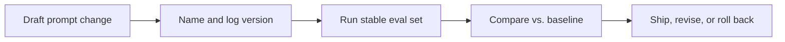

# Versioning And Testing

Prompt changes should be versioned, tested, and rollback-ready. Otherwise they create invisible product drift.

## Versioning Template

For each prompt version, record:

- version name or ID
- date
- owner
- what changed
- intended improvement
- plausible regression risk
- eval result summary

## Testing Flow

## A/B Testing In Production

Use A/B tests when:

- the behavior difference is user-visible
- offline eval suggests promise but not certainty
- enough traffic exists to compare meaningfully

Do not A/B test blindly on high-risk behaviors without blocker safeguards.

## Prompt Change Review Checklist

- What exact behavior is supposed to improve?
- What categories might regress?
- Which eval cases best test the intended improvement?
- Is rollback trivial if results worsen?
- What post-release signals will we watch first?

## Realistic Use Scenarios

### Scenario 1: Listing Description Prompt

Version `v3` adds stronger differentiation instructions. Offline eval improves specificity, but a small production test reveals more unsupported feature claims. The prompt is revised before broad rollout.

### Scenario 2: Search Intent Extraction Prompt

A new version improves ambiguous query parsing but increases latency due to longer reasoning instructions. The PM rolls back because user-facing speed matters more in that surface.

## Questions To Ask Your Engineering Team

- Where are prompt versions stored and named?
- Can we compare outputs across versions on the same eval set easily?
- What is the rollback path if a prompt regresses?
- Which prompt changes deserve production experimentation?
- Are prompt changes mixed together with model or context changes in a way that hides causality?

## Anti-Patterns

### The In-Place Edit

The prompt is edited directly. What goes wrong: no one can reconstruct what changed.

### The Demo-Only Test

A few handpicked examples are used as proof. What goes wrong: regressions remain hidden.

### The Mixed-Change Release

Prompt, model, and retrieval are changed together. What goes wrong: the team cannot tell what caused the result.

## Red Flags

- Prompt versions have no changelog
- Teams cannot reproduce prior prompt behavior
- Eval comparisons happen informally
- Production regressions are discovered through anecdotes first
- Rollback is technically possible but operationally unpracticed

## Bottom Line

Version prompts like product behavior artifacts. Test them against baselines. Keep rollback simple enough that the team will actually use it.
