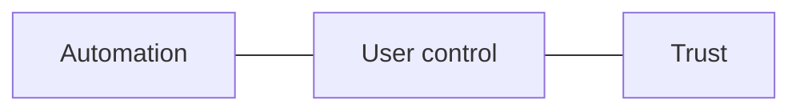

# AI UX Patterns

AI features create UX problems that traditional product patterns do not fully cover.

Users are not only reacting to interface layout. They are reacting to:

- uncertainty
- latency
- confidence signals
- imperfect answers
- mixed control between system and human
- personalization that can feel helpful or creepy

Many AI products still handle these badly. They either pretend the model is more confident than it is, or they overcompensate with awkward disclaimers that kill trust and utility at the same time.

This section is about designing better choices.

## What This Section Covers

- [`SKILL.md`](./SKILL.md): guided workflow for AI-specific UX decisions
- [`frameworks/latency-ux.md`](./frameworks/latency-ux.md): how to design for response-time reality
- [`frameworks/confidence-and-fallbacks.md`](./frameworks/confidence-and-fallbacks.md): graceful degradation and threshold design
- [`frameworks/human-in-the-loop.md`](./frameworks/human-in-the-loop.md): where user review or human oversight improves trust and safety
- [`frameworks/conversational-vs-structured.md`](./frameworks/conversational-vs-structured.md): when chat, forms, or hybrids fit best
- [`frameworks/error-and-hallucination-ux.md`](./frameworks/error-and-hallucination-ux.md): how to surface uncertainty and recover trust
- [`frameworks/personalization-ux.md`](./frameworks/personalization-ux.md): preference learning and transparency without creepiness
- [`examples/ai-search-results-page.md`](./examples/ai-search-results-page.md)
- [`examples/ai-onboarding-flow.md`](./examples/ai-onboarding-flow.md)
- [`examples/ai-assisted-form.md`](./examples/ai-assisted-form.md)

## The PM Lens

AI UX design is product strategy expressed visually and behaviorally.

Ask:

- what should the user believe about this system?
- when should the system act versus ask?
- how much waiting is acceptable?
- what should the product say when it is unsure?
- where should the user remain in control?

If those decisions are weak, no amount of UI polish will save the experience.

## Default Recommendations

### Recommendation 1: Design the failure path as carefully as the happy path

AI trust is built or lost in the edge cases.

### Recommendation 2: Match the interface to task structure

Not every AI feature should be a chat experience. Known-parameter tasks often work better as structured or hybrid flows.

### Recommendation 3: Be transparent without becoming apologetic

Users should understand limits and confidence, but they do not need a lecture every time.

### Recommendation 4: Use human control where it materially improves trust or correctness

Human-in-the-loop is a UX decision, not just an operations control.

## The Core Design Tension

AI UX lives in that tension. Too much automation without visibility feels scary. Too much friction kills value. The right answer depends on task risk, reversibility, and user expectation.
