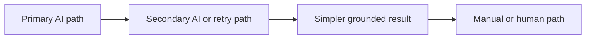

# Confidence And Fallbacks

Confidence is a product decision because it determines when the system should act, ask, defer, or hand off.

## Fallback Hierarchy

Not every feature needs all four levels, but every feature needs a plan.

## Designing Confidence Thresholds

Use stricter thresholds when:

- mistakes are costly
- outputs are hard to correct
- the system sounds authoritative

Use looser thresholds when:

- the output is advisory
- correction is easy
- the user still retains control

## Realistic Use Scenarios

### Scenario 1: Search Assistant

If the system is unsure about a soft preference, it can still show grounded results with a transparent caveat. If it is unsure about rent vs. buy, it should ask before acting.

### Scenario 2: AI Form Autofill

If a low-confidence field is easy for the user to verify, highlight it rather than blocking the whole flow. For high-risk fields, require confirmation.

## Questions To Ask Your Engineering Team

- Which confidence signals are reliable enough for product decisions?
- Which types of low-confidence output can still be shown with caveats?
- What is the user-facing fallback when confidence is below threshold?
- When should we ask a clarifying question instead of guessing?
- Which mistakes are annoying versus trust-damaging?

## Anti-Patterns

### Confidence Theater

The UI shows confidence styling, but it does not meaningfully change behavior. What goes wrong: users learn to ignore it.

### Block-Everything Threshold

The system becomes overcautious and constantly asks for confirmation. What goes wrong: speed and usefulness collapse.

### Guess-And-Polish

The product hides low confidence behind fluent language. What goes wrong: silent wrong answers damage trust.

## Red Flags

- Thresholds are the same across high-risk and low-risk tasks
- Fallbacks are generic error states
- Confidence indicators are not tied to actionability
- Clarification happens too often or not at all
- Product cannot explain what low confidence actually does

## Bottom Line

Confidence is only useful if it changes the user experience. Tie thresholds to fallback behavior users can actually understand and benefit from.
