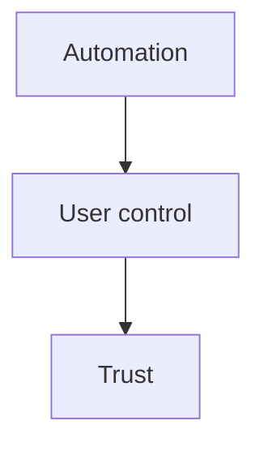

# AI UX Patterns

AI UX is where product teams either protect trust or quietly destroy it.

Most AI features do not fail because the layout is ugly. They fail because the product makes the wrong behavioral promises:

- it sounds more certain than it is
- it asks follow-up questions too often
- it hides latency behind empty motion
- it turns reversible tasks into scary automation
- it gives users no graceful path when the AI is wrong

This section is about avoiding those failures.

## The PM Lens

AI UX is not a visual layer added after the model works. It is product policy expressed in interaction design.

The real decisions are:

- what the user should believe about the system
- when the system should act versus ask
- how much waiting is acceptable for this task
- what should happen when confidence is low
- where human control must remain explicit
- what the recovery path is after a bad answer

If those choices are weak, polish will not save the experience.

## Default Stances

These are the default stances in this playbook.

### 1. Design the downgrade path before the delightful path

If the product has no graceful behavior when the AI is slow, unsure, or wrong, the happy path is not enough.

### 2. A clarification question is a cost, not a courtesy

Every extra question taxes user momentum. Ask only when the answer materially changes retrieval, execution, or risk.

### 3. Hybrid interfaces beat pure chat for parameter-heavy tasks

Marketplaces, forms, and workflow tools usually benefit from conversational capture plus structured refinement. Pure chat often hides too much state.

### 4. Never let fluent copy imply certainty you do not have

If the system is approximating, say so in a useful way. Do not launder weak evidence through smooth language.

### 5. Human control belongs where error cost is high or reversal is hard

Human-in-the-loop is not a moral preference. It is a product decision about risk, trust, and recoverability.

## Common Failure Stories

### Failure Story 1: The Smart-Sounding Search Layer

A marketplace assistant sounded helpful, but it kept implying neighborhood qualities the product could not verify. Users were not angry because the copy was clumsy. They were angry because the interface made unsupported claims sound authoritative.

### Failure Story 2: The Over-Eager Clarifier

A conversational search flow asked users follow-up questions for soft preferences that did not materially change retrieval. Completion dropped because the system kept slowing users down in the name of being helpful.

### Failure Story 3: The Polite Dead End

A generation feature failed with a friendly disclaimer and no usable next action. The language was kind. The UX was still bad because it killed user momentum.

These are product failures, not styling failures.

## What This Section Covers

- [`SKILL.md`](./SKILL.md): guided workflow for AI-specific UX decisions
- [`frameworks/latency-ux.md`](./frameworks/latency-ux.md): how to match waiting patterns to actual latency
- [`frameworks/confidence-and-fallbacks.md`](./frameworks/confidence-and-fallbacks.md): threshold design and graceful degradation
- [`frameworks/human-in-the-loop.md`](./frameworks/human-in-the-loop.md): where review or approval improves trust and safety
- [`frameworks/conversational-vs-structured.md`](./frameworks/conversational-vs-structured.md): when chat, forms, or hybrids fit best
- [`frameworks/error-and-hallucination-ux.md`](./frameworks/error-and-hallucination-ux.md): how to recover trust after bad outputs
- [`frameworks/personalization-ux.md`](./frameworks/personalization-ux.md): preference learning and transparency without creepiness
- [`examples/ai-search-results-page.md`](./examples/ai-search-results-page.md): hybrid conversational search UX
- [`examples/ai-onboarding-flow.md`](./examples/ai-onboarding-flow.md): expectation-setting for first use
- [`examples/ai-assisted-form.md`](./examples/ai-assisted-form.md): assisted completion with review and confirmation

## A Practical AI UX Review Order

When reviewing an AI feature, ask in this order:

1. What job is the AI doing for the user?
2. What happens when the AI is unsure?
3. What happens when it is wrong?
4. What does the user see while it is thinking?
5. What can the user correct, edit, or override?
6. What path remains if the AI layer fails completely?

That order matters. Teams that start with tone or layout often miss the behavioral contract.

## The Core Design Tension

AI UX lives in that tension.

- Too much automation without visibility feels reckless.
- Too much friction kills value.
- Too much caution language makes the product feel weak.
- Too little transparency makes it feel dishonest.

The right answer depends on task risk, reversibility, and user expectation, but the tension is always there.

## Opinionated Recommendations

### Recommendation 1: Make uncertainty useful

"I’m not sure" is not enough. If confidence is low, the interface should still help the user move forward through grounded results, editable chips, source visibility, or a simpler manual path.

### Recommendation 2: Show interpreted state, not hidden interpretation

If the system translates user language into constraints, the user should be able to see and usually edit those constraints.

### Recommendation 3: Streaming is only good if it creates real value early

Do not stream decorative text. Stream grounded progress, partial results, or visible step completion.

### Recommendation 4: Separate advisory AI from acting AI in the interface

Users tolerate uncertainty differently when the system is suggesting, summarizing, ranking, or taking action. The interface should make that role obvious.

## What Good AI UX Usually Looks Like

- the system’s role is legible
- the user can tell what was inferred
- the user can recover from bad interpretation quickly
- latency is acknowledged honestly
- fallback keeps momentum alive
- confidence is handled specifically, not theatrically

## Where To Go Next

Use this section with:

- [`../01-ai-prd-writing/`](../01-ai-prd-writing/README.md) when fallback behavior and user-facing failure rules belong in the PRD
- [`../02-evaluation-design/`](../02-evaluation-design/README.md) when UX risk depends on specific failure categories
- [`../04-ai-agent-system-design/`](../04-ai-agent-system-design/README.md) when orchestration choices are driving latency or trust issues

If your AI works in demos but feels brittle in real use, the missing layer is often here.
